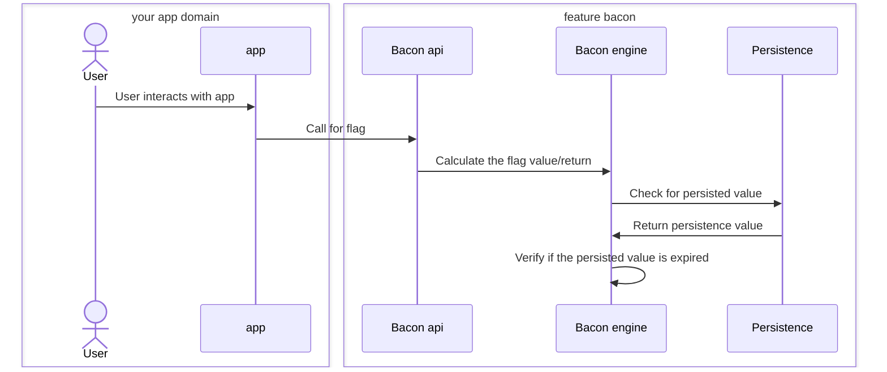

# Feature Bacon 🐷 🥓 

## Overview

The goal of feature bacon is to have a most complete tool to provide flags control for frontend, 
backend, mobile environments. Using different inputs to deliver flags, such as session variables, jwt tokens,
session data, headers, ip addresses, etc.

* Feature flag control
  * Return boolean values per environment, sessions, specific keys. Run A/B tests, collect data and results.

* Metrics exposure
  * Expose prometheus metrics about the platform usage

* Event driven architecture
  * Expose events in different event platforms, such as rabbitmq, kafka, google pub/sub, aws sqs, etc.

## Flags lifecycle

## Types of flags

* **Deterministic flags**: flags that are deterministic - they can be calculated given a specific input. 
They always return the same value given an input.
* **Random flags**: flags generated randomly, using some input data or no input data. Every call can generate a different value.
* **Persistent flags**: flags that can be either deterministic (same input always generate the same output) or dynamic/random. But the input data will be persisted so the output will be always the same given a input.

## Persistence options

* MongoDB
* Redis
* Postgresql

## Architecture

