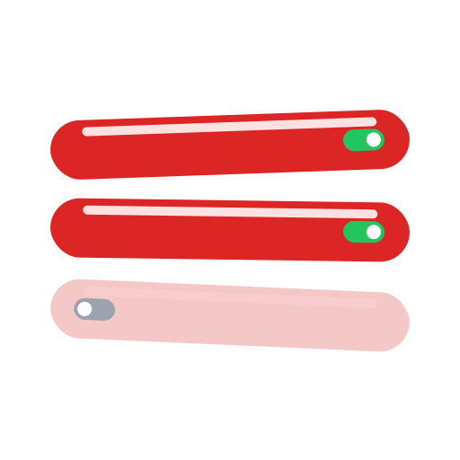
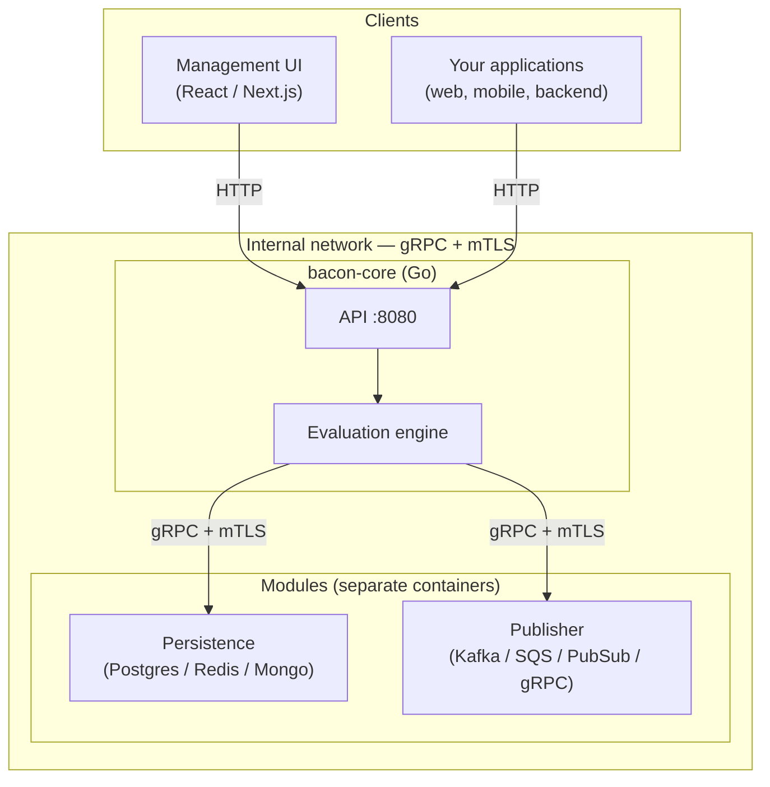
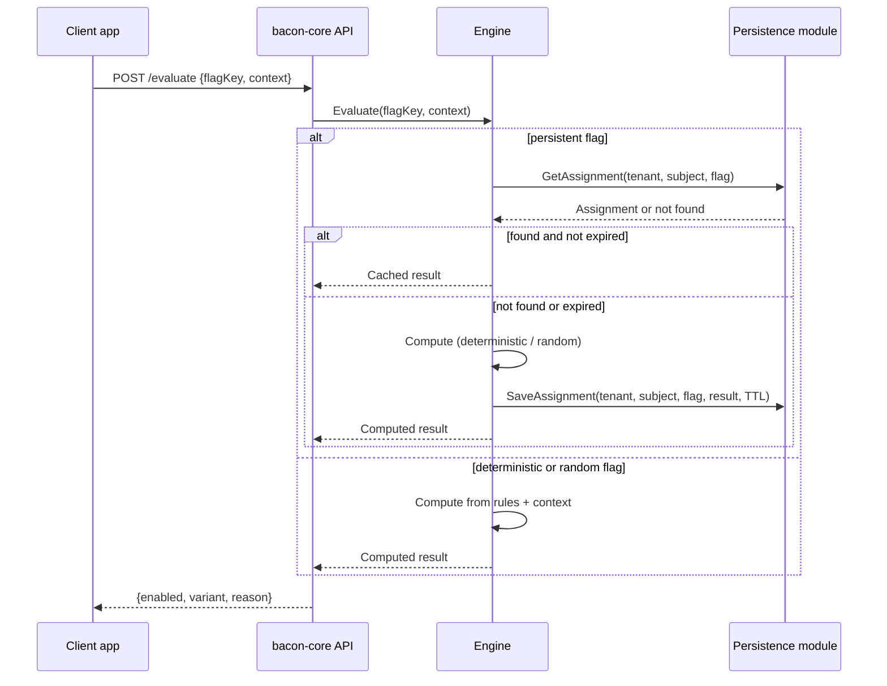

  <picture>
    <source media="(prefers-color-scheme: dark)" srcset="assets/logo-dark.svg">
    <source media="(prefers-color-scheme: light)" srcset="assets/logo-full.svg">
    
  </picture>

  <strong>Feature flags & experimentation platform</strong>

A **multi-tenant feature-flag and experimentation platform** built with Go and React/Next.js. Evaluate flags for web, backend, and mobile applications using rich context (JWT claims, headers, IP, session data, custom attributes), run A/B tests with stable variant assignment, and emit events to the systems you already use — all from one API.

Deploy it as a **standalone SaaS** serving many tenants or as a lightweight **sidecar** for a single application. Same codebase, different config.

## Key features

- **Feature flags** — boolean toggles and multivariate variants with per-environment rules and rollout percentages.
- **Three evaluation modes** — deterministic (same input → same output), random, and persistent (sticky assignment with TTL/expiry).
- **A/B and multivariate experiments** — define variants, allocate traffic, and get stable assignment per subject.
- **Multi-tenant by design** — tenant isolation on every request, in every data store query, and across all emitted events.
- **Pluggable persistence** — PostgreSQL, Redis, or MongoDB as out-of-process gRPC modules; or a **read-only config file** for flags-as-code with no database.
- **Pluggable integrations** — Kafka, SQS, GCP Pub/Sub, or generic gRPC publishers as out-of-process modules.
- **Modular architecture** — core and modules communicate over **gRPC + mTLS** on a private network. Only deploy what you need; unused SDKs never touch the core binary.
- **Observable** — Prometheus-compatible metrics (labeled per tenant), structured logging with correlation ids, and a health endpoint with per-module status.

## Architecture

```mermaid
graph TB
    subgraph clients["Clients"]
        ui["Management UI<br/>(React / Next.js)"]
        apps["Your applications<br/>(web, mobile, backend)"]
    end

    subgraph baconnet["Internal network — gRPC + mTLS"]
        subgraph core["bacon-core (Go)"]
            api["API :8080"]
            engine["Evaluation engine"]
            api --> engine
        end

        subgraph modules["Modules (separate containers)"]
            persist["Persistence<br/>(Postgres / Redis / Mongo)"]
            pub1["Publisher<br/>(Kafka / SQS / PubSub / gRPC)"]
        end

        engine -- "gRPC + mTLS" --> persist
        engine -- "gRPC + mTLS" --> pub1
    end

    ui -- "HTTP" --> api
    apps -- "HTTP" --> api
```

Each module is a **separate Docker image** implementing a standard gRPC service contract (`PersistenceService` or `PublisherService`). The core image contains no database drivers or broker SDKs.

## Evaluation lifecycle

```mermaid
sequenceDiagram
    participant client as Client app
    participant api as bacon-core API
    participant engine as Engine
    participant persist as Persistence module

    client->>api: POST /evaluate {flagKey, context}
    api->>engine: Evaluate(flagKey, context)

    alt persistent flag
        engine->>persist: GetAssignment(tenant, subject, flag)
        persist-->>engine: Assignment or not found
        alt found and not expired
            engine-->>api: Cached result
        else not found or expired
            engine->>engine: Compute (deterministic / random)
            engine->>persist: SaveAssignment(tenant, subject, flag, result, TTL)
            engine-->>api: Computed result
        end
    else deterministic or random flag
        engine->>engine: Compute from rules + context
        engine-->>api: Computed result
    end

    api-->>client: {enabled, variant, reason}
```

## Flag types

| Type              | Behavior                                                                                                                         |
| ----------------- | -------------------------------------------------------------------------------------------------------------------------------- |
| **Deterministic** | Same evaluation context always produces the same result (e.g. hash-based bucketing).                                             |
| **Random**        | May return different results across calls; useful for random sampling.                                                           |
| **Persistent**    | Result is stored so the subject sees the same outcome until TTL expires or rules change. Requires a writable persistence module. |

## Deployment modes

| Mode                    | Description                                                                                                          |
| ----------------------- | -------------------------------------------------------------------------------------------------------------------- |
| **SaaS (multi-tenant)** | One deployment serves many tenants. Tenant resolution on every request via subdomain, header, JWT claim, or API key. |
| **Sidecar**             | One instance dedicated to a single application. Implicit default tenant, minimal overhead.                           |

## Persistence options

| Backend         | Type                   | Notes                                                                                                                            |
| --------------- | ---------------------- | -------------------------------------------------------------------------------------------------------------------------------- |
| **PostgreSQL**  | Writable (gRPC module) | Full feature set including persistent assignments, CRUD, and audit.                                                              |
| **Redis**       | Writable (gRPC module) | Cache-oriented or sidecar deployments.                                                                                           |
| **MongoDB**     | Writable (gRPC module) | Document-oriented deployments.                                                                                                   |
| **Config file** | Read-only (in-process) | Flags defined in YAML/JSON/TOML, managed as code. No database required. Persistent flags and sticky experiments are unavailable. |

## Integration options

| Backend          | Notes                                            |
| ---------------- | ------------------------------------------------ |
| **Apache Kafka** | Streaming / event log.                           |
| **AWS SQS**      | Queue-based.                                     |
| **GCP Pub/Sub**  | Cloud messaging.                                 |
| **Generic gRPC** | Forward events to any gRPC endpoint you control. |

Multiple publishers can run in parallel for fan-out. Zero publishers is valid — events are silently discarded.

## Tech stack

| Layer                      | Technology                       |
| -------------------------- | -------------------------------- |
| Backend API + engine       | **Go**                           |
| Management UI              | **React** with **Next.js**       |
| Inter-module communication | **gRPC** with **mTLS**           |
| Metrics                    | **Prometheus**-compatible         |

## Specifications

Full product and technical specs live in `[openspec/](openspec/)` following the OpenSpec format (RFC 2119 requirements, Given/When/Then scenarios, mermaid diagrams):

| Domain          | Spec                                                          |
| --------------- | ------------------------------------------------------------- |
| System overview | [overview/spec.md](openspec/specs/overview/spec.md)           |
| Flag evaluation | [evaluation/spec.md](openspec/specs/evaluation/spec.md)       |
| Flag management | [management/spec.md](openspec/specs/management/spec.md)       |
| A/B experiments | [experiments/spec.md](openspec/specs/experiments/spec.md)     |
| Persistence     | [persistence/spec.md](openspec/specs/persistence/spec.md)     |
| Integrations    | [integrations/spec.md](openspec/specs/integrations/spec.md)   |
| Observability   | [observability/spec.md](openspec/specs/observability/spec.md) |
| Architecture    | [architecture/spec.md](openspec/specs/architecture/spec.md)   |

## Code Quality

All components are analyzed by [SonarCloud](https://sonarcloud.io/organizations/orlandoburli/projects).

### Backend

| Quality Gate | Coverage | Security | Maintainability | Reliability |
|:---:|:---:|:---:|:---:|:---:|
|  |  |  |  |  |

| Bugs | Vulnerabilities | Code Smells | Duplicated Lines |
|:---:|:---:|:---:|:---:|
|  |  |  |  |

### SDKs

| SDK | Quality Gate | Coverage | Security | Maintainability | Reliability |
|-----|:---:|:---:|:---:|:---:|:---:|
| **Go** |  |  |  |  |  |
| **JavaScript** |  |  |  |  |  |
| **Python** |  |  |  |  |  |
| **Java** |  |  |  |  |  |

### Samples

| Quality Gate | Security | Maintainability | Reliability |
|:---:|:---:|:---:|:---:|
|  |  |  |  |

## Status

Early stage — specifications are in place, implementation is next. Contributions and feedback welcome.

## License

This project is dual-licensed:

- **Open source** — [GNU Affero General Public License v3.0 (AGPL-3.0)](LICENSE). You can use, modify, and distribute Feature Bacon freely under the terms of the AGPL. If you run a modified version as a network service, you must make the source code of your modifications available to users of that service.

- **Commercial** — A commercial license is available for organizations that cannot or prefer not to comply with the AGPL (e.g. proprietary SaaS offerings, embedding without source disclosure). Contact [orlando.burli@gmail.com](mailto:orlando.burli@gmail.com) for details.

### Contributing

Contributions are welcome. By submitting a pull request, you agree to license your contribution under the AGPL-3.0 and grant the project maintainers the right to distribute it under the commercial license as well (CLA).