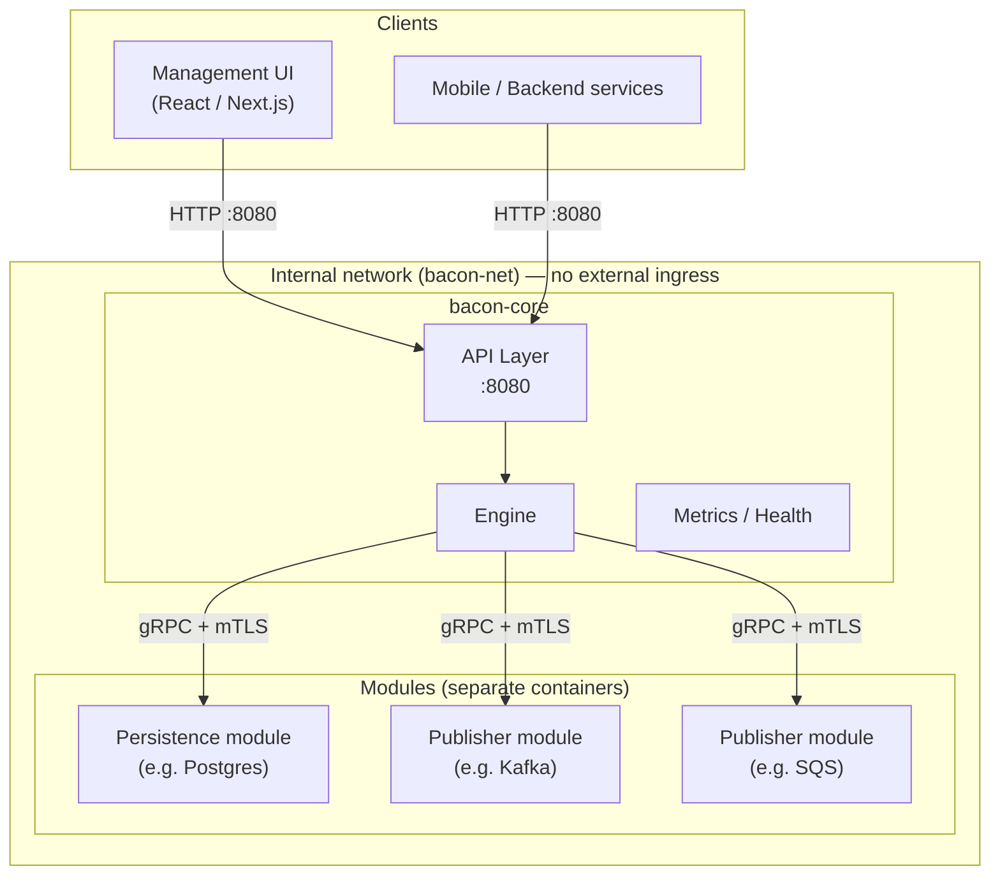
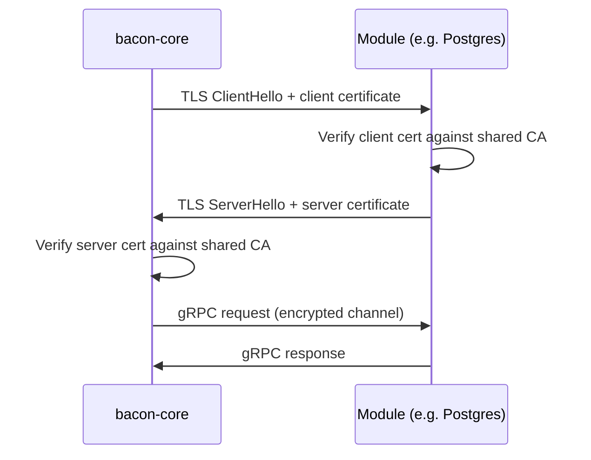
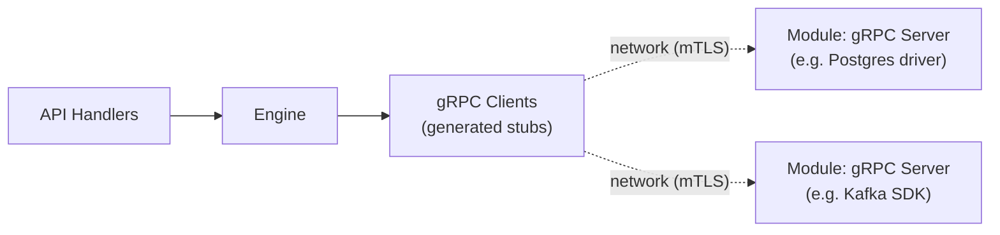
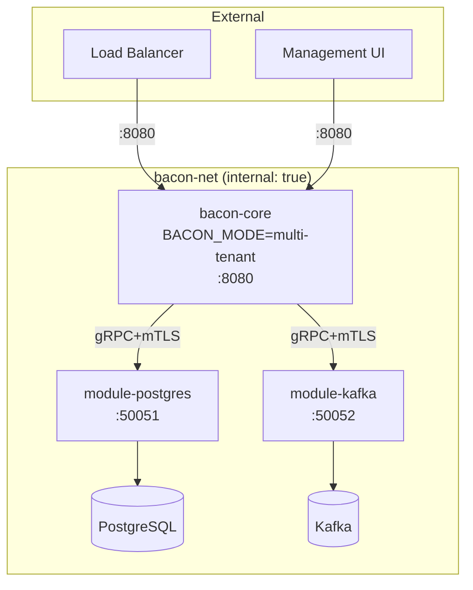
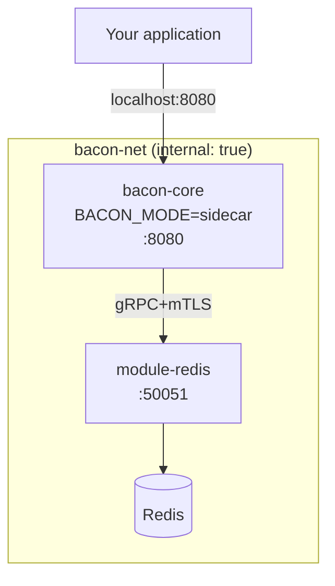

# Architecture Specification

## Purpose

Documents the technology stack, modular design, inter-process communication, security boundaries, and deployment architecture for Feature Bacon.

## Architecture Style

This system follows a **distributed modular** architecture. The core (API + engine) communicates with **out-of-process modules** (persistence, integrations) over **gRPC on a private network**. Each module is a separate container/binary that implements a well-known gRPC service contract. Only the modules needed for a given deployment are started.

## Requirements

### Requirement: TechnologyStack

The system SHALL use **Go** for the backend core and all modules, and **React with Next.js** for the management web UI.

#### Scenario: GoCoreImage
- **GIVEN** the core codebase
- **WHEN** the project is built
- **THEN** it produces a Docker image containing the API, engine, and gRPC clients for modules
- **AND** the image does not contain any persistence driver or broker SDK

#### Scenario: GoModuleImage
- **GIVEN** the postgres persistence module codebase
- **WHEN** the module is built
- **THEN** it produces a separate Docker image containing only the gRPC server and the postgres driver

#### Scenario: NextFrontend
- **GIVEN** the management UI codebase
- **WHEN** the project is built
- **THEN** it produces a deployable Next.js application that communicates with the Go backend API

### Requirement: OutOfProcessModules

All persistence and integration modules SHALL run as **separate processes** (containers) that communicate with the core over **gRPC**. The core binary MUST NOT link or import any database driver or broker SDK.

#### Scenario: SeparateContainers
- **GIVEN** a deployment with PostgreSQL persistence and Kafka publishing
- **WHEN** the system is running
- **THEN** three containers are active: `bacon-core`, `module-postgres`, `module-kafka`
- **AND** the core container has no postgres or kafka libraries in its binary

#### Scenario: CoreStartsWithoutModuleDeps
- **GIVEN** the core binary
- **WHEN** its Go dependencies are inspected
- **THEN** no database driver (e.g. `pgx`, `go-redis`, `mongo-driver`) or broker SDK (e.g. `sarama`, `aws-sdk-go`) appears

### Requirement: GRPCServiceContracts

Each module category (persistence, publisher) SHALL define a **proto contract** that all implementations of that category MUST implement. The core communicates with modules exclusively through these contracts.

#### Scenario: PersistenceContract
- **GIVEN** the `PersistenceService` proto definition
- **WHEN** a new persistence module (e.g. MongoDB) is developed
- **THEN** it implements the same `PersistenceService` gRPC interface
- **AND** the core requires no code changes to use it

#### Scenario: PublisherContract
- **GIVEN** the `PublisherService` proto definition
- **WHEN** a new publisher module (e.g. GCP Pub/Sub) is developed
- **THEN** it implements the same `PublisherService` gRPC interface

### Requirement: MutualTLSBetweenModules

All gRPC communication between the core and modules SHALL use **mutual TLS (mTLS)**. Both sides MUST present certificates signed by a shared CA and validate the peer's certificate.

#### Scenario: ValidmTLS
- **GIVEN** the core and a persistence module both have certificates signed by the same CA
- **WHEN** the core connects to the module
- **THEN** a mutual TLS handshake succeeds and requests are served

#### Scenario: RejectedUntrustedClient
- **GIVEN** a process with a certificate signed by an unknown CA
- **WHEN** it attempts to connect to a module's gRPC port
- **THEN** the connection is rejected at the TLS handshake

### Requirement: NetworkIsolation

Module gRPC ports MUST NOT be exposed outside the internal container network. Only the core's client-facing API port SHALL be reachable externally.

#### Scenario: InternalOnlyNetwork
- **GIVEN** a Docker deployment with an internal-only network (e.g. `internal: true`)
- **WHEN** a host-level port scan is performed
- **THEN** only the core API port (e.g. 8080) is reachable
- **AND** module gRPC ports (e.g. 50051, 50052) are not reachable from outside the container network

#### Scenario: ModuleToModuleIsolation
- **GIVEN** a persistence module and a publisher module on the same internal network
- **WHEN** the publisher module attempts to call the persistence module
- **THEN** the connection is rejected because only the core holds valid client certificates for persistence

### Requirement: ConfigurationDrivenModules

Module addresses and TLS material SHALL be provided entirely through configuration (environment variables, config files, or secrets). Adding or removing a module requires only configuration changes and container orchestration — no core code changes.

#### Scenario: AddPublisher
- **GIVEN** a running deployment with only a persistence module
- **WHEN** `BACON_PUBLISHER_ADDRS=bacon-kafka-module:50052` is added to core config and a kafka module container is started
- **THEN** the core connects to the new publisher on next restart
- **AND** events begin flowing to Kafka

### Requirement: MultiTenantAndSidecarModes

The system SHALL support both **multi-tenant SaaS** and **single-application sidecar** deployment from the same core image and module images, differing only in configuration.

#### Scenario: MultiTenantMode
- **GIVEN** `BACON_MODE=multi-tenant`
- **WHEN** the core starts
- **THEN** tenant resolution middleware is active on all endpoints
- **AND** persistence calls include tenant scoping

#### Scenario: SidecarMode
- **GIVEN** `BACON_MODE=sidecar`
- **WHEN** the core starts
- **THEN** a default tenant is implicitly used
- **AND** tenant resolution middleware is skipped

### Requirement: LayerSeparation

The system SHALL maintain separation between the API layer (handlers, routing), the engine (business logic), and the gRPC client layer that communicates with modules.

#### Scenario: NoDirectModuleAccess
- **GIVEN** an evaluation handler in the API layer
- **WHEN** it needs to resolve a flag
- **THEN** it calls the engine, which in turn calls the persistence gRPC client — the handler does not call gRPC directly

### Requirement: ModuleHealthChecks

The core SHALL perform gRPC health checks against configured modules at startup and periodically at runtime to report module availability through the observability health endpoint.

#### Scenario: StartupHealthGate
- **GIVEN** the persistence module is configured but unreachable
- **WHEN** the core starts
- **THEN** startup fails with a descriptive error and non-zero exit

#### Scenario: RuntimeDegradation
- **GIVEN** a publisher module becomes unreachable during operation
- **WHEN** the health endpoint is scraped
- **THEN** the response reports the publisher module as degraded

## Dependency flow

The core binary only depends on generated gRPC stubs. Database drivers and broker SDKs live exclusively inside their respective module binaries.

## Deployment composition examples

### SaaS (multi-tenant) with Postgres + Kafka

### Sidecar with Redis only (no publishers)

## Technical Notes

- **Backend language**: Go
- **Frontend framework**: React with Next.js
- **Inter-module communication**: gRPC with mTLS on a private container network
- **Proto contracts**: `PersistenceService`, `PublisherService` — defined in a shared `proto/` directory
- **Dependency direction**: Handlers → Engine → gRPC Clients → (network) → Module gRPC Servers
- **Persistence modules**: PostgreSQL, Redis, MongoDB (each a separate image)
- **Integration modules**: Kafka, SQS, GCP Pub/Sub, generic gRPC (each a separate image)
- **Deployment**: Container-based; one image for core, one image per module, one image for UI
