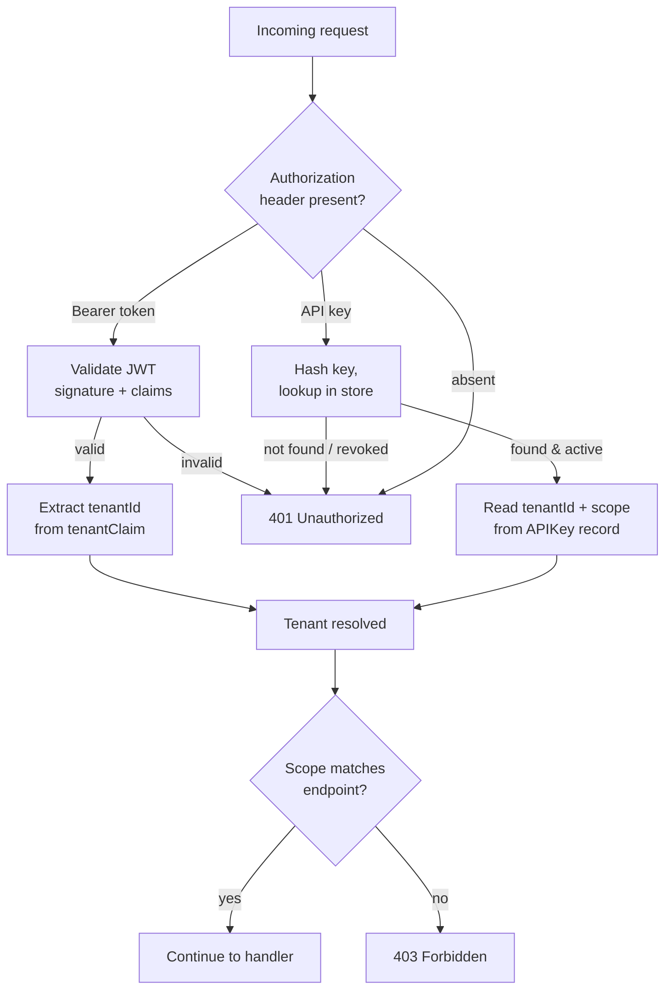

# Auth Specification

## Purpose

Handles authentication, API key lifecycle, JWT validation, and tenant resolution. Every request (evaluation or management) passes through auth to resolve and validate the tenant before reaching domain logic.

## Entities

### APIKey

| Property | Type | Description |
|----------|------|-------------|
| id | string | Unique identifier (UUID) |
| tenantId | string | Tenant this key is bound to |
| keyHash | string | SHA-256 hash of the raw key; the raw key is shown once at creation |
| keyPrefix | string | First 8 characters of the raw key, stored for identification (e.g. `ba_eval_`) |
| scope | enum | `evaluation` or `management` |
| name | string | Human-readable label (e.g. "production eval key") |
| createdBy | string | Identity of the actor who created the key |
| createdAt | timestamp | Creation time |
| revokedAt | timestamp | Revocation time; null if active |

### JWTConfig

| Property | Type | Description |
|----------|------|-------------|
| issuer | string | Expected `iss` claim value |
| audience | string | Expected `aud` claim value |
| jwksUrl | string | URL to fetch the JSON Web Key Set for signature validation |
| tenantClaim | string | JWT claim path that contains the tenant identifier (e.g. `org_id`, `tenant`) |
| scopeClaim | string | Optional claim path for scope (`evaluation` / `management`); if absent, scope is derived from the endpoint |

## Auth flow

## Requirements

### Requirement: APIKeyAuthentication

The system SHALL authenticate requests using API keys passed in the `Authorization` header (e.g. `Authorization: ApiKey ba_eval_xxxxxxxx`). The raw key is hashed and looked up in the persistence module (or config).

#### Scenario: ValidEvalKey
- **GIVEN** an active API key with scope `evaluation` for tenant `acme`
- **WHEN** a request to the evaluation endpoint includes this key
- **THEN** the request is authenticated and scoped to tenant `acme`

#### Scenario: RevokedKey
- **GIVEN** an API key that has been revoked (`revokedAt` is set)
- **WHEN** a request includes this key
- **THEN** the request is rejected with `401 Unauthorized`

#### Scenario: WrongScope
- **GIVEN** an API key with scope `evaluation`
- **WHEN** a request to the management endpoint includes this key
- **THEN** the request is rejected with `403 Forbidden`

### Requirement: APIKeyLifecycleSaaS

In SaaS mode with a writable persistence module, the system SHALL support API key CRUD via the management API.

#### Scenario: CreateKey
- **GIVEN** an authenticated admin for tenant `acme`
- **WHEN** they create a new API key with scope `evaluation` and name "prod eval"
- **THEN** the system returns the raw key **once**
- **AND** stores the hashed key, prefix, scope, tenant, and metadata

#### Scenario: ListKeys
- **GIVEN** an authenticated admin for tenant `acme`
- **WHEN** they list API keys
- **THEN** all keys for tenant `acme` are returned with prefix, scope, name, and status (active/revoked)
- **AND** raw keys are **never** returned

#### Scenario: RevokeKey
- **GIVEN** an active API key for tenant `acme`
- **WHEN** the admin revokes it
- **THEN** `revokedAt` is set and subsequent requests with this key are rejected

### Requirement: APIKeyLifecycleSidecar

In sidecar mode or config file persistence, API keys SHALL be defined in configuration (environment variables or config file).

#### Scenario: KeysFromEnv
- **GIVEN** `BACON_API_KEYS=ba_eval_xxx:evaluation,ba_mgmt_yyy:management`
- **WHEN** the core starts
- **THEN** both keys are loaded with the implicit default tenant

#### Scenario: KeysFromConfigFile
- **GIVEN** a config file with an `api_keys:` section per tenant
- **WHEN** the core starts
- **THEN** keys are loaded and bound to their respective tenants

### Requirement: JWTAuthentication

The system SHALL support JWT-based authentication. The JWT is validated against a JWKS endpoint, and the tenant is extracted from a configurable claim.

#### Scenario: ValidJWT
- **GIVEN** JWT config with `issuer: "https://auth.acme.com"`, `tenantClaim: "org_id"`
- **WHEN** a request arrives with a valid JWT containing `org_id: "acme"`
- **THEN** the request is authenticated and scoped to tenant `acme`

#### Scenario: ExpiredJWT
- **GIVEN** a JWT whose `exp` claim is in the past
- **WHEN** a request arrives with this token
- **THEN** the request is rejected with `401 Unauthorized`

#### Scenario: MissingTenantClaim
- **GIVEN** a valid JWT that does not contain the configured `tenantClaim`
- **WHEN** a request arrives with this token
- **THEN** the request is rejected with `401 Unauthorized`

#### Scenario: JWTNotConfigured
- **GIVEN** no JWT config is provided (API key only mode)
- **WHEN** a request arrives with a Bearer token
- **THEN** the request is rejected with `401 Unauthorized`

### Requirement: TenantResolutionPrecedence

When both API key and JWT are supported, the system SHALL resolve tenant using the following precedence: **API key first** (if `ApiKey` scheme), then **JWT** (if `Bearer` scheme). A request MUST use exactly one method.

#### Scenario: BothPresent
- **GIVEN** a request with both `ApiKey` and `Bearer` in headers
- **WHEN** the auth middleware processes it
- **THEN** the request is rejected with `400 Bad Request` indicating ambiguous authentication

### Requirement: SidecarBypass

In sidecar mode, authentication MAY be disabled entirely via configuration (`BACON_AUTH_ENABLED=false`). All requests use the implicit default tenant with no credential check. This is suitable for localhost-only or network-level security deployments.

#### Scenario: AuthDisabled
- **GIVEN** sidecar mode with `BACON_AUTH_ENABLED=false`
- **WHEN** a request arrives with no credentials
- **THEN** the request proceeds with the implicit default tenant

## Technical Notes

- **Key storage**: API keys are stored hashed (SHA-256) in the persistence module; in config mode they are defined in the config file or env vars
- **JWT validation**: Standard library or well-known Go JWT package; JWKS fetched and cached with configurable refresh interval
- **Dependencies**: persistence module (for SaaS key storage), management spec (key CRUD endpoints)
