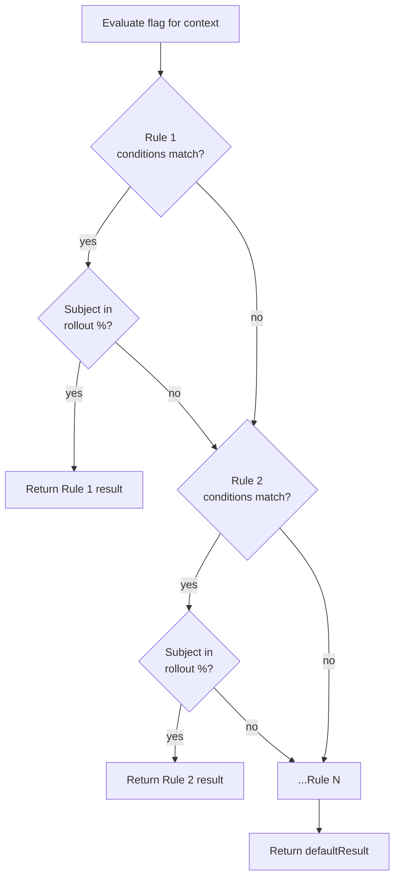
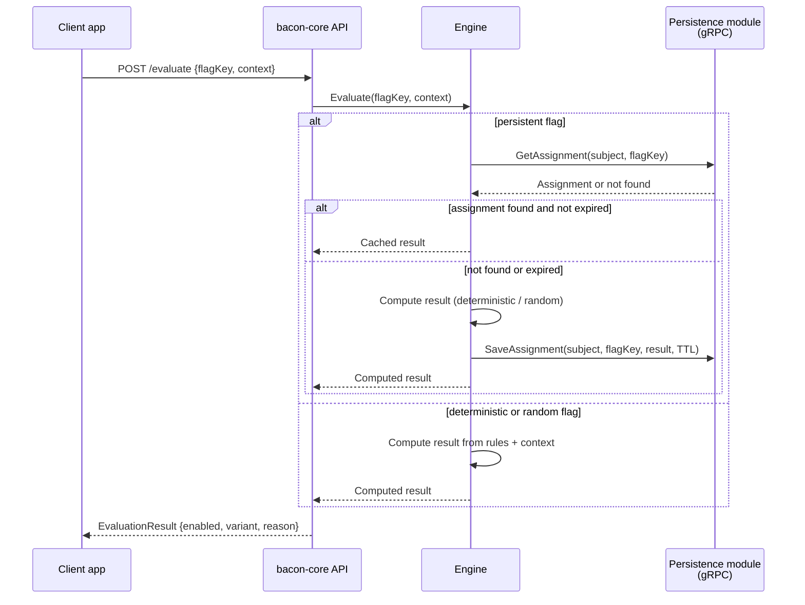

# Evaluation Specification

## Purpose

Evaluates feature flags for incoming requests using the evaluation context (user identity, environment, headers, JWT claims, IP, custom attributes) and the flag definition rules. This is the critical hot path — every client request that checks a flag passes through evaluation.

## Entities

### EvaluationContext

| Property | Type | Description |
|----------|------|-------------|
| tenantId | string | Resolved tenant identifier (from subdomain, header, JWT claim, or API key); implicit in sidecar mode |
| subjectId | string | Primary identifier for the subject (user id, device id, anonymous id) |
| environment | string | Target environment (e.g. `production`, `staging`, `dev`) |
| attributes | map[string]any | Arbitrary key-value pairs (JWT claims, headers, IP, geo, custom) |

### EvaluationResult

| Property | Type | Description |
|----------|------|-------------|
| tenantId | string | Tenant the evaluation was scoped to |
| flagKey | string | The flag that was evaluated |
| enabled | boolean | Whether the flag is on or off for this context |
| variant | string | The resolved variant label (e.g. `control`, `variant_a`); empty when boolean-only |
| reason | string | Why this result was returned (e.g. `rule_match`, `default`, `persisted`, `error`) |

## Requirements

### Requirement: SingleFlagEvaluation

The system SHALL evaluate a single flag given a flag key and an evaluation context, returning a result with enabled state, variant, and reason.

#### Scenario: DeterministicEvaluation
- **GIVEN** a flag `new_checkout` configured as deterministic with rule "enable for subjectId hashing into bucket 0–50%"
- **WHEN** evaluation is requested with subjectId `user_123` that hashes into bucket 32%
- **THEN** the result is `enabled: true` with reason `rule_match`

#### Scenario: RandomEvaluation
- **GIVEN** a flag `random_banner` configured as random with 30% chance enabled
- **WHEN** evaluation is requested
- **THEN** the result is `enabled: true` or `enabled: false` based on random generation
- **AND** the result MAY differ on subsequent calls for the same context

#### Scenario: PersistentEvaluation
- **GIVEN** a flag `onboarding_flow` configured as persistent with TTL of 7 days and a **writable** persistence module is active
- **WHEN** evaluation is requested for subjectId `user_456` for the first time
- **THEN** the engine computes and stores the assignment
- **AND** subsequent evaluations for the same subject return the same result until TTL expires

#### Scenario: PersistentFlagWithReadOnlyPersistence
- **GIVEN** a flag `onboarding_flow` configured as persistent but the system is running with **config file (read-only) persistence**
- **WHEN** evaluation is requested for subjectId `user_456`
- **THEN** the engine evaluates using the underlying logic (deterministic or random) **without** storing the assignment
- **AND** the result includes `reason: no_persistence`
- **AND** subsequent evaluations for the same subject MAY return a different result

### Requirement: BatchEvaluation

The system SHOULD support evaluating multiple flags in a single request to reduce round trips.

#### Scenario: BatchRequest
- **GIVEN** three active flags `flag_a`, `flag_b`, `flag_c`
- **WHEN** a batch evaluation is requested with a single evaluation context
- **THEN** results for all three flags are returned in one response

### Requirement: BooleanAndVariantResults

The system SHALL return at least **boolean** and **string variant** result types. The system MAY support structured payloads in future versions.

#### Scenario: BooleanFlag
- **GIVEN** a flag `maintenance_mode` with type boolean
- **WHEN** evaluated
- **THEN** the result contains `enabled: true` or `enabled: false` with an empty variant

#### Scenario: VariantFlag
- **GIVEN** a flag `checkout_style` with variants `control` and `redesign`
- **WHEN** evaluated for a subject assigned to `redesign`
- **THEN** the result contains `enabled: true` and `variant: "redesign"`

### Requirement: PersistedAssignmentExpiry

The system SHALL check TTL/expiry on persisted assignments and recompute when the assignment has expired.

#### Scenario: ExpiredAssignment
- **GIVEN** a persisted assignment for subjectId `user_789` with TTL of 1 hour set 2 hours ago
- **WHEN** evaluation is requested
- **THEN** the expired assignment is discarded
- **AND** a new assignment is computed and persisted

### Requirement: TenantResolution

Every evaluation request SHALL resolve a `tenantId` before processing. The tenant is derived from the request (subdomain, header, JWT claim, or API key mapping). In sidecar mode, the tenant is implicit. Requests with no resolvable tenant MUST be rejected.

#### Scenario: TenantFromHeader
- **GIVEN** a multi-tenant deployment
- **WHEN** an evaluation request arrives with header `X-Tenant-Id: acme`
- **THEN** the evaluation is scoped to tenant `acme`
- **AND** only flag definitions belonging to `acme` are considered

#### Scenario: TenantFromAPIKey
- **GIVEN** a multi-tenant deployment and API key `key_abc` bound to tenant `acme`
- **WHEN** an evaluation request uses `key_abc`
- **THEN** the evaluation is scoped to tenant `acme`

#### Scenario: MissingTenant
- **GIVEN** a multi-tenant deployment
- **WHEN** an evaluation request arrives with no resolvable tenant
- **THEN** the request is rejected with `401 Unauthorized` or `400 Bad Request`

#### Scenario: SidecarImplicitTenant
- **GIVEN** a sidecar deployment
- **WHEN** an evaluation request arrives
- **THEN** the default implicit tenant is used without any resolution overhead

### Requirement: TenantIsolation

Evaluation SHALL only access flag definitions and persisted assignments belonging to the resolved tenant. A request scoped to tenant A MUST NOT see or receive results from tenant B.

#### Scenario: CrossTenantPrevented
- **GIVEN** tenant A has flag `dark_mode` enabled and tenant B has flag `dark_mode` disabled
- **WHEN** evaluation is requested for `dark_mode` with `tenantId = A`
- **THEN** the result is `enabled: true`
- **AND** tenant B's definition is never consulted

### Requirement: UnknownOrDisabledFlagBehavior

The system SHALL return a safe default when a flag is unknown, disabled, or when evaluation fails.

#### Scenario: UnknownFlag
- **GIVEN** no flag definition exists for key `nonexistent_flag`
- **WHEN** evaluation is requested
- **THEN** the result is `enabled: false` with reason `not_found`

#### Scenario: DisabledFlag
- **GIVEN** a flag `old_feature` that is explicitly disabled
- **WHEN** evaluation is requested
- **THEN** the result is `enabled: false` with reason `disabled`

#### Scenario: EvaluationError
- **GIVEN** the persistence module is unreachable during evaluation of a persistent flag
- **WHEN** evaluation is requested
- **THEN** the result is `enabled: false` with reason `error`
- **AND** the error is logged with correlation context

### Requirement: ReadOnlyPersistenceAwareness

The evaluation engine SHALL detect whether the active persistence is read-only (config file mode) and adjust behavior for persistent and random flags accordingly, without failing.

#### Scenario: DeterministicUnaffected
- **GIVEN** config file persistence and a flag with `semantics: deterministic`
- **WHEN** evaluation is requested
- **THEN** behavior is identical to writable persistence — same context always yields the same result

#### Scenario: PersistentDegradesToUnderlying
- **GIVEN** config file persistence and a flag with `semantics: persistent`
- **WHEN** evaluation is requested
- **THEN** the flag is evaluated as if `semantics` were its underlying type (deterministic or random)
- **AND** a warning-level log entry is emitted on first occurrence per flag key

## Rules engine

### Condition model

A `Condition` tests a single attribute from the evaluation context against a value using an operator.

| Property | Type | Description |
|----------|------|-------------|
| attribute | string | Dot-path into the evaluation context (e.g. `attributes.country`, `subjectId`, `environment`) |
| operator | enum | One of the supported operators below |
| value | any | The operand to compare against; type depends on operator |

### Supported operators

| Operator | Description | Value type | Example |
|----------|-------------|------------|---------|
| `equals` | Exact match (string, number, boolean) | scalar | `country equals "BR"` |
| `not_equals` | Negation of equals | scalar | `plan not_equals "free"` |
| `in` | Attribute is one of the listed values | []scalar | `country in ["BR", "US", "DE"]` |
| `not_in` | Attribute is not in the list | []scalar | `role not_in ["bot", "internal"]` |
| `contains` | String attribute contains substring | string | `email contains "@acme.com"` |
| `starts_with` | String attribute starts with prefix | string | `path starts_with "/v2/"` |
| `ends_with` | String attribute ends with suffix | string | `hostname ends_with ".internal"` |
| `greater_than` | Numeric comparison (>) | number | `age greater_than 18` |
| `less_than` | Numeric comparison (<) | number | `cart_total less_than 100` |
| `regex` | Attribute matches a regular expression | string (pattern) | `user_agent regex "^Mozilla.*"` |
| `semver_match` | Attribute satisfies a semver constraint | string (constraint) | `app_version semver_match ">=2.0.0"` |

All comparisons are **case-sensitive** by default. A condition with an **absent attribute** evaluates to false (does not match).

### Rule evaluation order

Rules within a flag definition are evaluated **top to bottom (first match wins)**. When a rule's conditions all match:

1. The subject is checked against the rule's `rolloutPercentage` using deterministic bucketing.
2. If the subject falls within the rollout, the rule's result (enabled + variant) is returned.
3. If the subject falls outside the rollout, evaluation continues to the next rule.

If **no rule matches**, the flag's `defaultResult` is returned.

### Deterministic bucketing

For **deterministic** and **persistent** semantics the engine MUST produce stable, uniformly distributed assignments:

1. **Hash input**: concatenate `tenantId + ":" + flagKey + ":" + subjectId` (UTF-8, no padding).
2. **Hash function**: **MurmurHash3** (32-bit variant) — fast and well-distributed for bucketing; not cryptographic.
3. **Bucket**: `hash_value mod 100` → integer in range `[0, 99]`.
4. **Match**: if `bucket < rolloutPercentage` the subject is **in** the rollout.

This guarantees:
- Same subject + same flag + same tenant → same bucket every time (deterministic).
- Different flags produce different assignments for the same subject (flagKey is part of the hash input).
- Uniform distribution across subjects (~1% per bucket).

#### Scenario: BucketingStability
- **GIVEN** flag `new_checkout` with `rolloutPercentage: 50` for tenant `acme`
- **WHEN** subject `user_123` is evaluated repeatedly
- **THEN** the bucket is always the same value
- **AND** the result is always the same (enabled or not)

#### Scenario: BucketingDistribution
- **GIVEN** flag `feature_x` with `rolloutPercentage: 25`
- **WHEN** 10,000 distinct subjects are evaluated
- **THEN** approximately 25% (±3%) receive `enabled: true`

#### Scenario: CrossFlagIndependence
- **GIVEN** two flags `flag_a` and `flag_b` both at 50% rollout
- **WHEN** the same subject is evaluated for both
- **THEN** the bucket for `flag_a` and `flag_b` are independently computed (different hash inputs)
- **AND** the subject MAY be in rollout for one but not the other

### Random evaluation

For **random** semantics, the engine generates a random number per call (not hashed from context), so the result MAY vary across requests for the same subject. The `rolloutPercentage` determines the probability of `enabled: true`.

## Evaluation lifecycle

## Technical Notes

- **Implementation**: Evaluation engine in Go; exposed via HTTP API; calls persistence module over gRPC + mTLS
- **Dependencies**: persistence module (for persisted flags and flag definitions)
- **Performance**: This is the hot path — latency budget is tight; concrete SLO TBD
