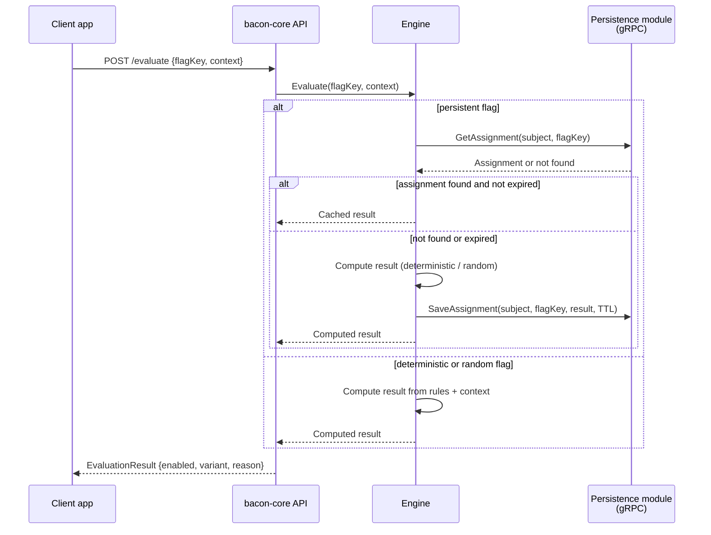

# Evaluation Specification

## Purpose

Evaluates feature flags for incoming requests using the evaluation context (user identity, environment, headers, JWT claims, IP, custom attributes) and the flag definition rules. This is the critical hot path — every client request that checks a flag passes through evaluation.

## Entities

### EvaluationContext

| Property | Type | Description |
|----------|------|-------------|
| subjectId | string | Primary identifier for the subject (user id, device id, anonymous id) |
| environment | string | Target environment (e.g. `production`, `staging`, `dev`) |
| attributes | map[string]any | Arbitrary key-value pairs (JWT claims, headers, IP, geo, custom) |

### EvaluationResult

| Property | Type | Description |
|----------|------|-------------|
| flagKey | string | The flag that was evaluated |
| enabled | boolean | Whether the flag is on or off for this context |
| variant | string | The resolved variant label (e.g. `control`, `variant_a`); empty when boolean-only |
| reason | string | Why this result was returned (e.g. `rule_match`, `default`, `persisted`, `error`) |

## Requirements

### Requirement: SingleFlagEvaluation

The system SHALL evaluate a single flag given a flag key and an evaluation context, returning a result with enabled state, variant, and reason.

#### Scenario: DeterministicEvaluation
- **GIVEN** a flag `new_checkout` configured as deterministic with rule "enable for subjectId hashing into bucket 0–50%"
- **WHEN** evaluation is requested with subjectId `user_123` that hashes into bucket 32%
- **THEN** the result is `enabled: true` with reason `rule_match`

#### Scenario: RandomEvaluation
- **GIVEN** a flag `random_banner` configured as random with 30% chance enabled
- **WHEN** evaluation is requested
- **THEN** the result is `enabled: true` or `enabled: false` based on random generation
- **AND** the result MAY differ on subsequent calls for the same context

#### Scenario: PersistentEvaluation
- **GIVEN** a flag `onboarding_flow` configured as persistent with TTL of 7 days and a **writable** persistence module is active
- **WHEN** evaluation is requested for subjectId `user_456` for the first time
- **THEN** the engine computes and stores the assignment
- **AND** subsequent evaluations for the same subject return the same result until TTL expires

#### Scenario: PersistentFlagWithReadOnlyPersistence
- **GIVEN** a flag `onboarding_flow` configured as persistent but the system is running with **config file (read-only) persistence**
- **WHEN** evaluation is requested for subjectId `user_456`
- **THEN** the engine evaluates using the underlying logic (deterministic or random) **without** storing the assignment
- **AND** the result includes `reason: no_persistence`
- **AND** subsequent evaluations for the same subject MAY return a different result

### Requirement: BatchEvaluation

The system SHOULD support evaluating multiple flags in a single request to reduce round trips.

#### Scenario: BatchRequest
- **GIVEN** three active flags `flag_a`, `flag_b`, `flag_c`
- **WHEN** a batch evaluation is requested with a single evaluation context
- **THEN** results for all three flags are returned in one response

### Requirement: BooleanAndVariantResults

The system SHALL return at least **boolean** and **string variant** result types. The system MAY support structured payloads in future versions.

#### Scenario: BooleanFlag
- **GIVEN** a flag `maintenance_mode` with type boolean
- **WHEN** evaluated
- **THEN** the result contains `enabled: true` or `enabled: false` with an empty variant

#### Scenario: VariantFlag
- **GIVEN** a flag `checkout_style` with variants `control` and `redesign`
- **WHEN** evaluated for a subject assigned to `redesign`
- **THEN** the result contains `enabled: true` and `variant: "redesign"`

### Requirement: PersistedAssignmentExpiry

The system SHALL check TTL/expiry on persisted assignments and recompute when the assignment has expired.

#### Scenario: ExpiredAssignment
- **GIVEN** a persisted assignment for subjectId `user_789` with TTL of 1 hour set 2 hours ago
- **WHEN** evaluation is requested
- **THEN** the expired assignment is discarded
- **AND** a new assignment is computed and persisted

### Requirement: UnknownOrDisabledFlagBehavior

The system SHALL return a safe default when a flag is unknown, disabled, or when evaluation fails.

#### Scenario: UnknownFlag
- **GIVEN** no flag definition exists for key `nonexistent_flag`
- **WHEN** evaluation is requested
- **THEN** the result is `enabled: false` with reason `not_found`

#### Scenario: DisabledFlag
- **GIVEN** a flag `old_feature` that is explicitly disabled
- **WHEN** evaluation is requested
- **THEN** the result is `enabled: false` with reason `disabled`

#### Scenario: EvaluationError
- **GIVEN** the persistence module is unreachable during evaluation of a persistent flag
- **WHEN** evaluation is requested
- **THEN** the result is `enabled: false` with reason `error`
- **AND** the error is logged with correlation context

### Requirement: ReadOnlyPersistenceAwareness

The evaluation engine SHALL detect whether the active persistence is read-only (config file mode) and adjust behavior for persistent and random flags accordingly, without failing.

#### Scenario: DeterministicUnaffected
- **GIVEN** config file persistence and a flag with `semantics: deterministic`
- **WHEN** evaluation is requested
- **THEN** behavior is identical to writable persistence — same context always yields the same result

#### Scenario: PersistentDegradesToUnderlying
- **GIVEN** config file persistence and a flag with `semantics: persistent`
- **WHEN** evaluation is requested
- **THEN** the flag is evaluated as if `semantics` were its underlying type (deterministic or random)
- **AND** a warning-level log entry is emitted on first occurrence per flag key

## Evaluation lifecycle

## Technical Notes

- **Implementation**: Evaluation engine in Go; exposed via HTTP API; calls persistence module over gRPC + mTLS
- **Dependencies**: persistence module (for persisted flags and flag definitions)
- **Performance**: This is the hot path — latency budget is tight; concrete SLO TBD
