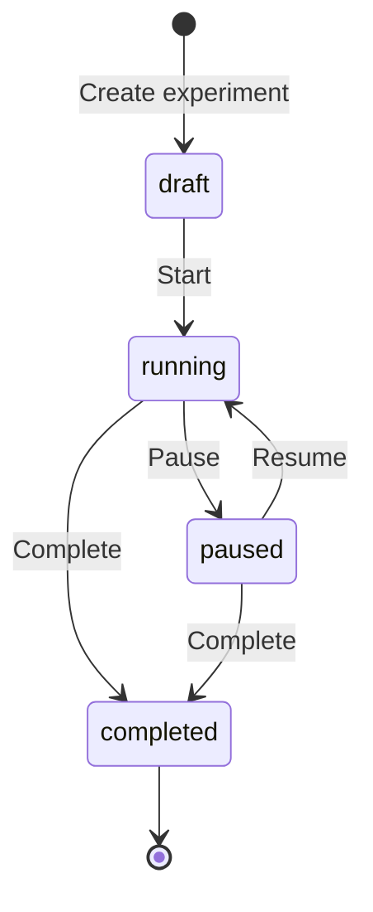
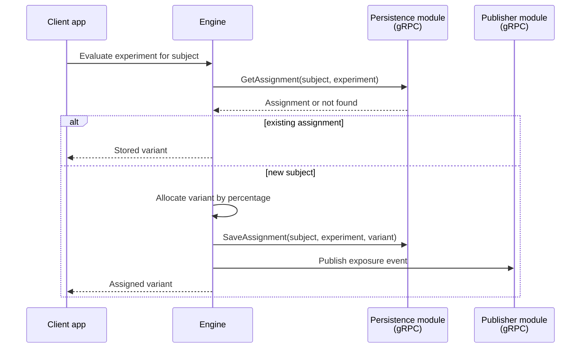

# Experiments Specification

## Purpose

Supports A/B and multivariate experiments: defining variants with traffic allocation, ensuring stable assignment per subject, and providing hooks for exposure and conversion tracking.

## Entities

### Experiment

| Property | Type | Description |
|----------|------|-------------|
| key | string | Unique experiment identifier |
| name | string | Human-readable name |
| variants | []Variant | Two or more arms of the experiment |
| allocation | []Allocation | Traffic split per variant (must sum to 100%) |
| status | enum | `draft`, `running`, `paused`, `completed` |
| stickyAssignment | boolean | Whether subjects keep their variant for the experiment lifetime |

### Variant

| Property | Type | Description |
|----------|------|-------------|
| key | string | Variant identifier (e.g. `control`, `variant_a`) |
| description | string | What this arm represents |

### Allocation

| Property | Type | Description |
|----------|------|-------------|
| variantKey | string | References a variant key |
| percentage | int | 0–100, traffic share |

## Requirements

### Requirement: ExperimentDefinition

The system SHALL allow defining experiments with two or more variants and a traffic allocation that sums to 100%.

#### Scenario: CreateExperiment
- **GIVEN** an authenticated admin
- **WHEN** an experiment `checkout_redesign` is created with variants `control` (50%) and `redesign` (50%)
- **THEN** the experiment is stored in `draft` status

#### Scenario: InvalidAllocation
- **GIVEN** an experiment definition with allocations summing to 80%
- **WHEN** creation is attempted
- **THEN** the request is rejected with a validation error

### Requirement: StableAssignment

The system SHALL assign a stable variant per subject for the lifetime of a running experiment when `stickyAssignment` is enabled. **This requires a writable persistence module.**

#### Scenario: ConsistentVariant
- **GIVEN** a running experiment `checkout_redesign` with sticky assignment enabled and a **writable** persistence module
- **WHEN** subject `user_100` is evaluated multiple times
- **THEN** the same variant is returned every time

#### Scenario: NewSubjectAssignment
- **GIVEN** a running experiment with 50/50 allocation and a **writable** persistence module
- **WHEN** a previously unseen subject is evaluated
- **THEN** the subject is assigned to a variant based on the allocation percentages
- **AND** the assignment is persisted

#### Scenario: StickyAssignmentWithReadOnlyPersistence
- **GIVEN** an experiment with `stickyAssignment: true` but the system is running with **config file (read-only) persistence**
- **WHEN** a subject is evaluated
- **THEN** a variant is assigned based on allocation percentages but **not persisted**
- **AND** subsequent evaluations for the same subject MAY return a different variant
- **AND** the result includes a reason indicating degraded behavior (e.g. `no_persistence`)

### Requirement: ExperimentLifecycle

The system SHALL support transitioning experiments through `draft` → `running` → `paused` → `completed` states.

#### Scenario: StartExperiment
- **GIVEN** an experiment in `draft` status
- **WHEN** the admin starts the experiment
- **THEN** the status changes to `running`
- **AND** evaluations begin returning variant assignments

#### Scenario: PauseExperiment
- **GIVEN** a running experiment
- **WHEN** the admin pauses the experiment
- **THEN** evaluations return the default/control variant
- **AND** existing assignments are preserved for resumption

### Requirement: ExposureTracking

The system SHOULD provide a mechanism to record exposure events when a subject is shown a variant, for later analysis.

#### Scenario: ExposureEvent
- **GIVEN** a running experiment `checkout_redesign`
- **WHEN** subject `user_200` is evaluated and assigned variant `redesign`
- **THEN** an exposure event is emitted containing experiment key, variant key, subject id, and timestamp

### Requirement: ConversionTracking

The system MAY support recording conversion events tied to an experiment for outcome measurement.

#### Scenario: ConversionEvent
- **GIVEN** subject `user_200` assigned to variant `redesign` in experiment `checkout_redesign`
- **WHEN** the application reports a conversion event (e.g. `purchase_completed`)
- **THEN** the event is recorded with experiment key, variant key, subject id, event name, and timestamp

## Experiment lifecycle

## Experiment evaluation flow

### Requirement: ReadOnlyPersistenceAwareness

When running with config file persistence, experiments with `stickyAssignment: true` SHALL operate in **degraded mode**. The system MUST make this limitation visible to operators.

#### Scenario: StartupWarning
- **GIVEN** config file persistence and experiments with `stickyAssignment: true` defined in the file
- **WHEN** the core starts
- **THEN** a warning is logged listing the experiments that will not have stable assignments

#### Scenario: DeterministicExperimentUnaffected
- **GIVEN** config file persistence and an experiment with `stickyAssignment: false`
- **WHEN** subjects are evaluated
- **THEN** behavior is identical to writable persistence — variants are assigned per allocation on every request

## Technical Notes

- **Implementation**: Extends the evaluation engine; experiment definitions stored alongside flags
- **Dependencies**: evaluation (variant resolution), persistence module (sticky assignments via gRPC), integrations modules (exposure/conversion events via gRPC)
- **Config file mode**: Experiment definitions are loaded from the file; sticky assignment is unavailable — see persistence spec feature availability matrix
