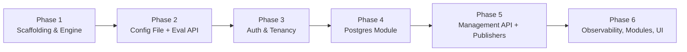

# Implementation Plan

## Purpose

Phased implementation roadmap for Feature Bacon. Each phase produces a runnable, testable artifact and builds on the previous one. The plan follows the specifications defined in the [overview](../overview/spec.md).

## Dependency graph

## Milestone summary

| Phase | Milestone | Deliverable |
|:-----:|-----------|-------------|
| 1 | Engine compiles and passes unit tests | `go test ./internal/engine/...` green |
| 2 | First runnable binary — evaluate flags from a YAML file | `docker run bacon-core` + `curl /api/v1/evaluate` |
| 3 | Authenticated requests with tenant isolation | API keys and JWT working in both SaaS and sidecar modes |
| 4 | Persistent assignments via Postgres over gRPC + mTLS | `docker compose up` with core + module-postgres; conformance suite green |
| 5 | Full CRUD + event publishing | Management API operational; Kafka events flowing |
| 6 | Production-ready | Metrics, logging, all modules, management UI |

---

## Phase 1 — Scaffolding & engine

### Goal

Establish the repository structure, proto contracts, code generation pipeline, and the evaluation engine with full unit test coverage. No I/O, no HTTP — pure logic.

### Tasks

| # | Task | Spec reference | Output |
|---|------|----------------|--------|
| 1.1 | Create repo layout: `backend/`, `frontend/`, `proto/`, `deploy/`, `certs/` | [architecture](../architecture/spec.md) — Repository layout | Directory tree |
| 1.2 | Initialize `backend/go.mod`, `go.work` | [architecture](../architecture/spec.md) — TechnologyStack | Go module |
| 1.3 | Write `proto/bacon/v1/persistence.proto` | [grpc-contracts](../grpc-contracts/spec.md) — PersistenceService | Proto file |
| 1.4 | Write `proto/bacon/v1/publisher.proto` | [grpc-contracts](../grpc-contracts/spec.md) — PublisherService | Proto file |
| 1.5 | Configure `buf.yaml` + `buf.gen.yaml`, generate Go stubs into `backend/gen/` | [grpc-contracts](../grpc-contracts/spec.md) — Technical Notes | Generated code |
| 1.6 | Create `Makefile` with targets: `generate`, `lint`, `test`, `build` | [architecture](../architecture/spec.md) | Makefile |
| 1.7 | Implement evaluation engine (`internal/engine/engine.go`) | [evaluation](../evaluation/spec.md) — SingleFlagEvaluation | Engine package |
| 1.8 | Implement condition operators (`internal/engine/rules.go`) | [evaluation](../evaluation/spec.md) — Supported operators | 11 operators |
| 1.9 | Implement MurmurHash3 bucketing (`internal/engine/bucket.go`) | [evaluation](../evaluation/spec.md) — Deterministic bucketing | Bucketing function |
| 1.10 | Implement rule evaluation loop (first match wins) | [evaluation](../evaluation/spec.md) — Rule evaluation order | Rule matcher |
| 1.11 | Unit tests for engine, rules, bucketing (≥90% coverage) | [architecture](../architecture/spec.md) — UnitTestCoverage | Test suite |
| 1.12 | Implement batch evaluation | [evaluation](../evaluation/spec.md) — BatchEvaluation | Batch function |

### Acceptance criteria

- `make generate` produces Go stubs from proto files without errors
- `make test` passes with ≥90% coverage on `internal/engine/`
- Bucketing distribution test confirms uniformity across 100k subjects
- No external dependencies (no database drivers, no HTTP server)

---

## Phase 2 — Config file persistence + evaluation API

### Goal

First runnable binary. Load flag definitions from a YAML config file, serve the evaluation API over HTTP, return RFC 7807 errors. This is the minimal end-to-end path.

### Tasks

| # | Task | Spec reference | Output |
|---|------|----------------|--------|
| 2.1 | Config file loader — single file with tenant keys | [persistence](../persistence/spec.md) — ConfigFileSchema | `internal/configfile/loader.go` |
| 2.2 | Config file loader — directory with per-tenant files | [persistence](../persistence/spec.md) — ConfigFileSchema (DirectoryMultiTenant) | Same package, directory mode |
| 2.3 | Validation on load (reject malformed entries) | [persistence](../persistence/spec.md) — ValidationOnLoad | Startup error on bad config |
| 2.4 | SIGHUP / file-watch reload | [persistence](../persistence/spec.md) — ConfigFilePersistence | Hot reload support |
| 2.5 | Application config loading (`internal/config/config.go`) | [architecture](../architecture/spec.md) — ConfigurationDrivenModules | Env vars + defaults |
| 2.6 | RFC 7807 error helpers (`internal/api/problem/`) | [api](../api/spec.md) — Error format | Problem detail builder |
| 2.7 | HTTP router + server setup (`internal/api/router.go`) | [api](../api/spec.md) | Chi or stdlib router |
| 2.8 | Correlation ID middleware | [api](../api/spec.md) — CorrelationId | `X-Request-Id` header |
| 2.9 | Version header middleware | [api](../api/spec.md) — VersionHeader | `X-Bacon-Version` header |
| 2.10 | `POST /api/v1/evaluate` handler | [api](../api/spec.md) — Evaluation endpoints | Evaluate handler |
| 2.11 | `POST /api/v1/evaluate/batch` handler | [api](../api/spec.md) — Batch evaluation | Batch handler |
| 2.12 | `GET /healthz` and `GET /readyz` handlers | [api](../api/spec.md) — Operational endpoints | Health handlers |
| 2.13 | `cmd/bacon-core/main.go` entrypoint | [architecture](../architecture/spec.md) — Repository layout | Main binary |
| 2.14 | `deploy/docker/Dockerfile.core` | [architecture](../architecture/spec.md) — Deployment | Docker image |
| 2.15 | Sample `flags.yaml` for local testing | [persistence](../persistence/spec.md) — Config file schema | Example config |
| 2.16 | Integration test: start binary with config file, call evaluate | — | End-to-end test |

### Acceptance criteria

- `docker build` produces a working image
- `curl POST /api/v1/evaluate` with a valid flag key returns an `EvaluationResult`
- Unknown flag returns RFC 7807 `not-found` problem
- `/healthz` returns 200
- Config file reload on SIGHUP updates flag definitions without restart

### Environment variables introduced

| Variable | Default | Description |
|----------|---------|-------------|
| `BACON_MODE` | `sidecar` | `multi-tenant` or `sidecar` |
| `BACON_PERSISTENCE` | `file` | `file` or `grpc` |
| `BACON_CONFIG_FILE` | `/etc/bacon/flags.yaml` | Path to config file or directory |
| `BACON_HTTP_ADDR` | `:8080` | HTTP listen address |
| `BACON_LOG_LEVEL` | `info` | `debug`, `info`, `warn`, `error` |
| `BACON_LOG_FORMAT` | `json` | `json` or `text` |

---

## Phase 3 — Auth & tenant resolution

### Goal

Secure the API with API key and JWT authentication. Enforce tenant isolation on every request. Support both SaaS (multi-tenant) and sidecar (implicit tenant) modes.

### Tasks

| # | Task | Spec reference | Output |
|---|------|----------------|--------|
| 3.1 | API key hashing + lookup (`internal/auth/apikey.go`) | [auth](../auth/spec.md) — APIKeyAuthentication | API key validator |
| 3.2 | API keys from env vars (sidecar mode) | [auth](../auth/spec.md) — APIKeyLifecycleSidecar (KeysFromEnv) | Config loader |
| 3.3 | API keys from config file | [auth](../auth/spec.md) — APIKeyLifecycleSidecar (KeysFromConfigFile) | Config parser |
| 3.4 | JWT validation with JWKS (`internal/auth/jwt.go`) | [auth](../auth/spec.md) — JWTAuthentication | JWT validator |
| 3.5 | JWKS caching with configurable refresh | [auth](../auth/spec.md) — JWTAuthentication | JWKS cache |
| 3.6 | Auth middleware (`internal/api/middleware/auth.go`) | [auth](../auth/spec.md) — Auth flow | Middleware |
| 3.7 | Tenant resolution middleware (`internal/api/middleware/tenant.go`) | [evaluation](../evaluation/spec.md) — TenantResolution | Middleware |
| 3.8 | Scope enforcement (eval vs management endpoints) | [auth](../auth/spec.md) — WrongScope | Scope check |
| 3.9 | Sidecar bypass (`BACON_AUTH_ENABLED=false`) | [auth](../auth/spec.md) — SidecarBypass | Bypass mode |
| 3.10 | Tenant isolation in config file loader | [evaluation](../evaluation/spec.md) — TenantIsolation | Scoped reads |
| 3.11 | Tests: valid key, revoked key, wrong scope, expired JWT, missing tenant | [auth](../auth/spec.md) — all scenarios | Test suite |

### Acceptance criteria

- Requests without credentials receive `401 Unauthorized` (RFC 7807)
- Evaluation key cannot access management endpoints (`403 Forbidden`)
- JWT with valid signature and `tenantClaim` resolves the correct tenant
- Sidecar mode with `BACON_AUTH_ENABLED=false` allows unauthenticated access
- Tenant A cannot see tenant B's flags

### Environment variables introduced

| Variable | Default | Description |
|----------|---------|-------------|
| `BACON_AUTH_ENABLED` | `true` | Disable auth entirely (sidecar only) |
| `BACON_API_KEYS` | — | Comma-separated `key:scope` pairs for config-driven keys |
| `BACON_JWT_ISSUER` | — | Expected JWT issuer |
| `BACON_JWT_AUDIENCE` | — | Expected JWT audience |
| `BACON_JWT_JWKS_URL` | — | JWKS endpoint URL |
| `BACON_JWT_TENANT_CLAIM` | `tenant` | Claim path for tenant ID |

---

## Phase 4 — gRPC persistence module (Postgres)

### Goal

First out-of-process module. Implement `PersistenceService` in a Postgres module, connect core to it over gRPC + mTLS. Enable persistent flag assignments and experiment sticky assignments.

### Tasks

| # | Task | Spec reference | Output |
|---|------|----------------|--------|
| 4.1 | gRPC client wrapper (`internal/grpcclient/persistence.go`) | [grpc-contracts](../grpc-contracts/spec.md) — PersistenceService | Client with mTLS |
| 4.2 | mTLS configuration (CA cert, client cert, client key) | [architecture](../architecture/spec.md) — MutualTLSBetweenModules | TLS config loader |
| 4.3 | Development certificate generation script | [architecture](../architecture/spec.md) — MutualTLSBetweenModules | `certs/generate.sh` |
| 4.4 | Persistence module scaffold (`backend/modules/postgres/`) | [architecture](../architecture/spec.md) — GoModuleImage | Module skeleton |
| 4.5 | Postgres schema + migrations | [grpc-contracts](../grpc-contracts/spec.md) — entities | SQL migrations |
| 4.6 | Implement all `PersistenceService` RPCs for Postgres | [grpc-contracts](../grpc-contracts/spec.md) — PersistenceService | gRPC server |
| 4.7 | `cmd/module-postgres/main.go` entrypoint | [architecture](../architecture/spec.md) — Repository layout | Module binary |
| 4.8 | `deploy/docker/Dockerfile.module` (Postgres) | [architecture](../architecture/spec.md) — Deployment | Docker image |
| 4.9 | Core: switch between config file and gRPC persistence based on `BACON_PERSISTENCE` | [persistence](../persistence/spec.md) — modes | Persistence abstraction |
| 4.10 | Persistent flag assignments (save + retrieve + TTL expiry) | [evaluation](../evaluation/spec.md) — PersistentEvaluation | Assignment flow |
| 4.11 | Shared conformance test suite (`backend/internal/conformance/`) | [architecture](../architecture/spec.md) — ConformanceSuite | Test package |
| 4.12 | Postgres conformance tests with testcontainers | [architecture](../architecture/spec.md) — ConformanceSuite | `go test` + testcontainers |
| 4.13 | `deploy/docker/docker-compose.yaml` (core + postgres module + postgres db) | [architecture](../architecture/spec.md) — SaaS deployment | Compose file |
| 4.14 | Integration test: evaluate persistent flag via core → module-postgres | — | Docker compose test |

### Acceptance criteria

- `make test-conformance-postgres` passes all conformance tests against a real Postgres via testcontainers
- `docker compose up` starts core + module-postgres + Postgres database
- Persistent flags return the same result for the same subject across requests
- TTL expiry recomputes assignments
- mTLS handshake fails with untrusted certificates
- Core binary contains zero Postgres driver code

### Environment variables introduced

| Variable | Default | Description |
|----------|---------|-------------|
| `BACON_PERSISTENCE_ADDR` | — | gRPC address of the persistence module (e.g. `module-postgres:50051`) |
| `BACON_TLS_CA` | — | Path to CA certificate |
| `BACON_TLS_CERT` | — | Path to client/server certificate |
| `BACON_TLS_KEY` | — | Path to client/server private key |
| `MODULE_POSTGRES_DSN` | — | Postgres connection string (module-side) |
| `MODULE_GRPC_ADDR` | `:50051` | gRPC listen address (module-side) |

---

## Phase 5 — Management API + publishers

### Goal

Complete the management API (flag CRUD, experiment lifecycle, API key management). Implement the first publisher module (Kafka) and wire event publishing into management and evaluation flows.

### Tasks

| # | Task | Spec reference | Output |
|---|------|----------------|--------|
| 5.1 | Flag CRUD handlers (GET/POST/PUT/PATCH/DELETE) | [api](../api/spec.md) — Flag Management | `internal/api/handlers/flags.go` |
| 5.2 | Experiment CRUD + lifecycle handlers (start/pause/complete) | [api](../api/spec.md) — Experiment Management | `internal/api/handlers/experiments.go` |
| 5.3 | API key management handlers (list/create/revoke) | [api](../api/spec.md) — API Key Management | `internal/api/handlers/apikeys.go` |
| 5.4 | Pagination (page/per_page) across all list endpoints | [api](../api/spec.md) — PaginationConsistency | Pagination helpers |
| 5.5 | Read-only mode enforcement (409 on writes in config file mode) | [api](../api/spec.md) — ReadOnlyModeEnforcement | Mode check middleware |
| 5.6 | API key CRUD via `PersistenceService` (SaaS mode) | [auth](../auth/spec.md) — APIKeyLifecycleSaaS | Key store integration |
| 5.7 | gRPC client wrapper for publishers (`internal/grpcclient/publisher.go`) | [grpc-contracts](../grpc-contracts/spec.md) — PublisherService | Client with mTLS |
| 5.8 | Kafka publisher module (`backend/modules/kafka/`) | [integrations](../integrations/spec.md) | gRPC server + Kafka SDK |
| 5.9 | `cmd/module-kafka/main.go` entrypoint | [architecture](../architecture/spec.md) | Module binary |
| 5.10 | Event publishing on flag changes (`flag.created`, `flag.updated`, etc.) | [grpc-contracts](../grpc-contracts/spec.md) — Event types | Publish calls |
| 5.11 | Event publishing on experiment exposure (`experiment.exposure`) | [grpc-contracts](../grpc-contracts/spec.md) — Event types | Publish calls |
| 5.12 | Optional publishers (core runs fine with zero publishers configured) | [integrations](../integrations/spec.md) — OptionalPublishers | Graceful skip |
| 5.13 | Parallel publishers (multiple publisher modules simultaneously) | [integrations](../integrations/spec.md) — ParallelPublishers | Fan-out |
| 5.14 | Publisher conformance tests with testcontainers (Kafka) | [architecture](../architecture/spec.md) — ConformanceSuite | Test suite |
| 5.15 | Update `docker-compose.yaml` with module-kafka + Kafka broker | — | Compose update |

### Acceptance criteria

- `POST /api/v1/flags` creates a flag; `GET /api/v1/flags` returns it
- Experiment lifecycle transitions (`draft → running → paused → completed`) work correctly
- API key creation returns the raw key once; subsequent list calls show only the prefix
- Config file mode returns `409 read-only-mode` for all write endpoints
- Flag creation publishes a `flag.created` event to Kafka
- Core operates normally with zero publishers configured

### Environment variables introduced

| Variable | Default | Description |
|----------|---------|-------------|
| `BACON_PUBLISHER_ADDRS` | — | Comma-separated gRPC addresses of publisher modules |
| `MODULE_KAFKA_BROKERS` | — | Kafka broker addresses (module-side) |
| `MODULE_KAFKA_TOPIC` | `bacon-events` | Default topic (module-side) |

---

## Phase 6 — Observability, additional modules, frontend

### Goal

Production readiness. Add metrics, structured logging, remaining persistence and publisher modules, and the management UI.

### Sub-phases

#### 6a — Observability

| # | Task | Spec reference | Output |
|---|------|----------------|--------|
| 6a.1 | Prometheus metrics with tenant labels | [observability](../observability/spec.md) — PrometheusMetrics | `GET /metrics` |
| 6a.2 | Standard metrics: `bacon_evaluations_total`, `bacon_evaluation_duration_seconds`, `bacon_grpc_requests_total` | [observability](../observability/spec.md) | Counters + histograms |
| 6a.3 | Structured JSON logging with `tenant_id`, `correlation_id`, `flag_key` | [observability](../observability/spec.md) — StructuredLogging | Logger setup |
| 6a.4 | Module-level health in `/readyz` response | [api](../api/spec.md) — Operational endpoints | Health aggregation |

#### 6b — Additional modules

| # | Task | Spec reference | Output |
|---|------|----------------|--------|
| 6b.1 | Redis persistence module + conformance tests | [persistence](../persistence/spec.md), [architecture](../architecture/spec.md) | `module-redis` |
| 6b.2 | MongoDB persistence module + conformance tests | [persistence](../persistence/spec.md), [architecture](../architecture/spec.md) | `module-mongo` |
| 6b.3 | SQS publisher module + conformance tests | [integrations](../integrations/spec.md) | `module-sqs` |
| 6b.4 | GCP Pub/Sub publisher module + conformance tests | [integrations](../integrations/spec.md) | `module-pubsub` |
| 6b.5 | Generic gRPC publisher module | [integrations](../integrations/spec.md) | `module-grpc` |

#### 6c — Management UI

| # | Task | Spec reference | Output |
|---|------|----------------|--------|
| 6c.1 | Next.js project scaffold (`frontend/`) | [architecture](../architecture/spec.md) — TechnologyStack | Next.js app |
| 6c.2 | Flag list + detail + create/edit pages | [api](../api/spec.md) — Flag Management | UI pages |
| 6c.3 | Experiment list + detail + lifecycle controls | [api](../api/spec.md) — Experiment Management | UI pages |
| 6c.4 | API key management page | [api](../api/spec.md) — API Key Management | UI page |
| 6c.5 | Health dashboard | [api](../api/spec.md) — Operational endpoints | UI page |
| 6c.6 | `deploy/docker/Dockerfile.frontend` | [architecture](../architecture/spec.md) | Docker image |

### Acceptance criteria

- Prometheus scrape of `/metrics` returns labeled counters and histograms
- Logs are structured JSON with correlation and tenant context
- `make test-conformance-redis`, `make test-conformance-mongo` pass
- Publisher modules deliver events to their respective backends
- Management UI can list, create, edit, toggle, and delete flags via the API
- Full `docker compose` stack runs: core + postgres module + kafka module + UI

---

## CI/CD pipeline

Implemented alongside Phase 1 and extended in each phase.

| Workflow | Trigger | Steps |
|----------|---------|-------|
| `ci.yaml` | Push to any branch, PRs to `main` | Lint (golangci-lint, buf lint) → Unit tests → Conformance tests (testcontainers) → Build all images |
| `release.yaml` | Tag `v*` on `main` | Build → Push images to registry → Create GitHub release |

---

## Risk register

| Risk | Impact | Mitigation |
|------|--------|------------|
| mTLS complexity slows local development | Medium | Phase 4.3 provides a cert generation script; `BACON_TLS_ENABLED=false` disables mTLS for local dev |
| Proto contract changes break modules | High | buf breaking-change detection in CI; additive-only changes per [grpc-contracts](../grpc-contracts/spec.md) — BackwardCompatibility |
| Testcontainers flaky in CI | Medium | Pin container images; retry logic; dedicated Docker-in-Docker runner |
| Config file mode edge cases (hot reload race conditions) | Low | File-watch debounce; atomic swap via temp file + rename; test coverage |
| Tenant cardinality in Prometheus labels | Medium | Document upper-bound guidance in [observability](../observability/spec.md) — TenantAwareMetrics |

---

## Open decisions

These items are intentionally deferred and will be resolved during implementation:

| Item | Phase | Options |
|------|-------|---------|
| HTTP router library | 2 | `net/http` (stdlib) vs `chi` vs `echo` |
| Structured logging library | 2 | `slog` (stdlib, Go 1.21+) vs `zap` vs `zerolog` |
| JWT library | 3 | `golang-jwt/jwt` vs `lestrrat-go/jwx` |
| Migration tool (Postgres) | 4 | `goose` vs `golang-migrate` vs `atlas` |
| MurmurHash3 library | 1 | `spaolacci/murmur3` vs inline implementation |
| Kubernetes manifests | 6+ | Helm chart vs raw manifests vs Kustomize |
