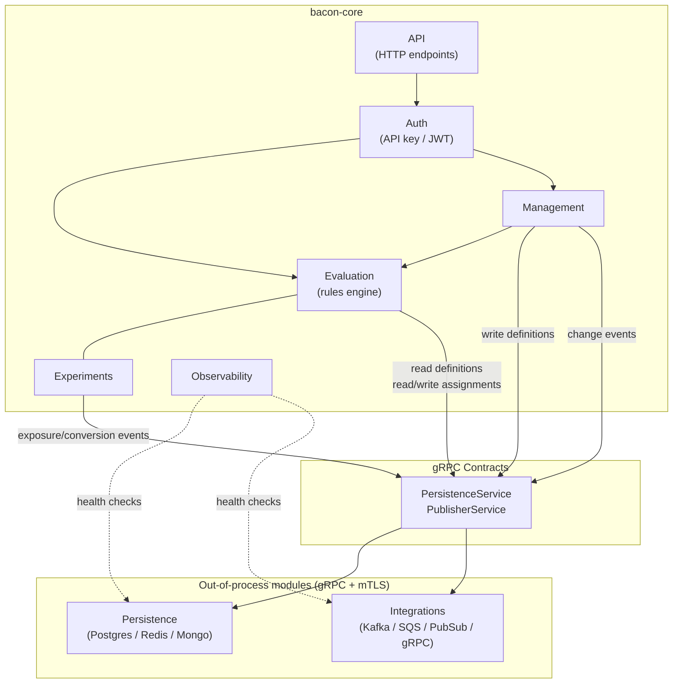

# System Overview

## Purpose

Feature Bacon is a feature-flag and experimentation platform that centralizes flag evaluation, A/B testing, and gradual rollouts for web, backend, and mobile applications. It replaces ad-hoc conditionals scattered across services with a single API driven by rich evaluation context.

## Domains

| Domain | Description | Spec |
|--------|-------------|------|
| evaluation | Flag evaluation engine, rules, bucketing | [spec.md](../evaluation/spec.md) |
| management | Flag and experiment CRUD | [spec.md](../management/spec.md) |
| experiments | A/B and multivariate testing | [spec.md](../experiments/spec.md) |
| persistence | Pluggable data stores and config file mode | [spec.md](../persistence/spec.md) |
| integrations | Outbound event publishing to external systems | [spec.md](../integrations/spec.md) |
| observability | Metrics, structured logging, health | [spec.md](../observability/spec.md) |
| api | HTTP API surface, endpoints, RFC 7807 errors | [spec.md](../api/spec.md) |
| auth | API key lifecycle, JWT validation, tenant resolution | [spec.md](../auth/spec.md) |
| grpc-contracts | PersistenceService and PublisherService proto definitions | [spec.md](../grpc-contracts/spec.md) |
| architecture | Technology stack, repo layout, deployment, testing | [spec.md](../architecture/spec.md) |
| implementation-plan | Phased roadmap, milestones, tasks, acceptance criteria | [spec.md](../implementation-plan/spec.md) |

## Requirements

### Requirement: SystemHealth

The system SHALL expose a health endpoint suitable for load balancers and orchestrators.

#### Scenario: HealthCheck
- **GIVEN** the system is running and its primary persistence module is reachable
- **WHEN** the health endpoint is called
- **THEN** a 200 response is returned with component-level status

#### Scenario: DegradedHealth
- **GIVEN** the system is running but an optional module (e.g. event publisher) is unreachable
- **WHEN** the health endpoint is called
- **THEN** the response indicates degraded status for the failing component
- **AND** the overall status reflects partial availability

### Requirement: DeploymentModes

The system SHALL support execution as a **standalone multi-tenant application** (SaaS) or as a **sidecar / single-application companion**, controlled entirely by configuration.

#### Scenario: MultiTenantStartup
- **GIVEN** the configuration enables multi-tenant mode
- **WHEN** the application starts
- **THEN** tenant resolution is enforced on every request (via subdomain, header, JWT claim, or API key)
- **AND** persistence is scoped per tenant

#### Scenario: SidecarStartup
- **GIVEN** the configuration enables sidecar mode
- **WHEN** the application starts
- **THEN** a default implicit tenant is used
- **AND** tenant routing overhead is eliminated

## Domain map

## Technical Notes

- **Backend**: Go — API, evaluation engine, admin operations, metrics
- **Frontend**: React with Next.js — management console and dashboards
- **Persistence**: MongoDB, Redis, or PostgreSQL as out-of-process gRPC modules
- **Integrations**: Kafka, SQS, GCP Pub/Sub, generic gRPC as out-of-process gRPC modules
