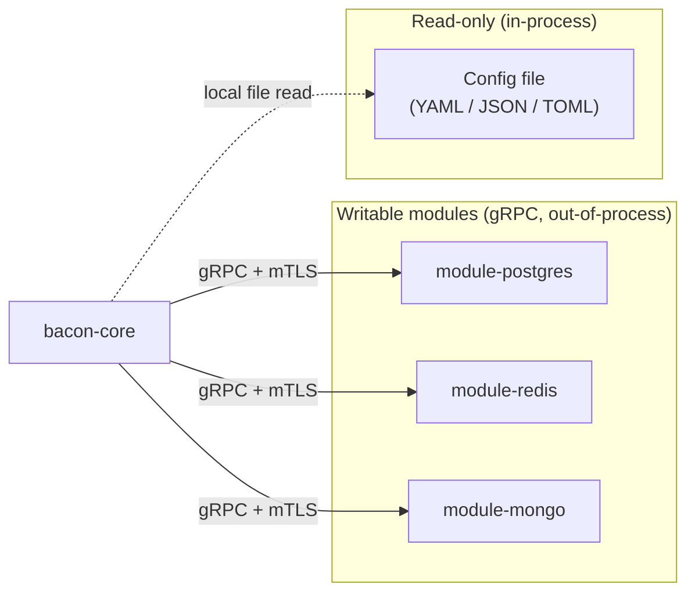

# Persistence Specification

## Purpose

Provides storage for flag definitions, experiment configurations, persisted assignments, and audit data. Each persistence backend runs as a **separate process/container** implementing the `PersistenceService` gRPC contract — with one exception: the **file-based module**, which is read-only and runs in-process within the core.

## Persistence modes

| Mode | Writable | External process | Use case |
|------|----------|-----------------|----------|
| **PostgreSQL module** | Yes | Yes (gRPC) | Production SaaS, full feature set |
| **Redis module** | Yes | Yes (gRPC) | Sidecar or cache-oriented deployments |
| **MongoDB module** | Yes | Yes (gRPC) | Document-oriented deployments |
| **Config file** | **No (read-only)** | **No (in-process)** | Flags-as-code, static definitions managed in version control |

## Feature availability by persistence mode

Not all features are available when using the read-only config file. The following matrix documents what is and is not supported.

| Feature | Writable module | Config file (read-only) |
|---------|:-:|:-:|
| Evaluate deterministic flags | Yes | Yes |
| Evaluate random flags | Yes | Yes |
| **Persistent flag assignments** (sticky results across requests) | Yes | **No** — no storage for assignments; persistent flags degrade to their underlying semantics (deterministic or random) per request |
| **Experiment sticky assignments** | Yes | **No** — each evaluation recomputes; subjects may see different variants across requests |
| **Flag CRUD via API / UI** | Yes | **No** — definitions are read from the file; the management API and UI operate in read-only mode |
| **Audit trail** | Yes | **No** — no write path to record changes |
| **Exposure / conversion event storage** | Via integration modules | Via integration modules (no persistence needed) |
| Multi-tenant data isolation | Yes (scoped by `tenant_id` on every gRPC call) | **Limited** — tenant scoping via top-level keys in the file (e.g. one section per tenant) must be defined statically |
| Runtime definition changes | Yes (via management API) | **No** — requires editing the file and restarting (or triggering a reload signal) |

> **Operators MUST understand these limitations before choosing the config file mode.** Any flag with `semantics: persistent` or experiment with `stickyAssignment: true` will **not behave as specified** without a writable persistence module.

## Requirements

### Requirement: GRPCPersistenceContract

Each writable persistence module SHALL implement the `PersistenceService` gRPC service definition. The core interacts with writable persistence exclusively through this contract.

#### Scenario: PostgresModule
- **GIVEN** the postgres persistence module is running and reachable on the internal network
- **WHEN** the core calls `GetFlagDefinition` over gRPC
- **THEN** the module queries PostgreSQL and returns the flag definition

#### Scenario: RedisModule
- **GIVEN** the redis persistence module is running and reachable on the internal network
- **WHEN** the core calls `GetAssignment` over gRPC
- **THEN** the module queries Redis and returns the persisted assignment

#### Scenario: NewBackendAdoption
- **GIVEN** a new persistence module (e.g. MongoDB) implementing `PersistenceService`
- **WHEN** it is deployed and the core is configured with its address
- **THEN** the core uses it with no code changes

### Requirement: ConfigFilePersistence

The system SHALL support a **read-only config file** as a persistence source. Flag and experiment definitions are loaded from a local file (YAML, JSON, or TOML) at startup and optionally reloaded on a signal (e.g. SIGHUP) or file-watch event.

#### Scenario: StartWithConfigFile
- **GIVEN** `BACON_PERSISTENCE=file` and `BACON_CONFIG_FILE=/etc/bacon/flags.yaml`
- **WHEN** the core starts
- **THEN** flag definitions are loaded from the file
- **AND** no gRPC persistence module is required

#### Scenario: FlagsAsCode
- **GIVEN** a team manages flag definitions in a YAML file checked into version control
- **WHEN** the file is deployed alongside the core (e.g. via ConfigMap or volume mount)
- **THEN** the core serves those definitions without any database

#### Scenario: HotReload
- **GIVEN** the core is running with config file persistence
- **WHEN** the file contents change and a reload signal is sent (or file-watch triggers)
- **THEN** the core reloads definitions without a full restart

#### Scenario: WriteOperationRejected
- **GIVEN** the core is running with config file persistence
- **WHEN** a management API request attempts to create, update, or delete a flag
- **THEN** the request is rejected with a clear error indicating read-only mode

### Requirement: ConfigFileLimitations

When using config file persistence, the core SHALL clearly communicate degraded behavior for features that require write access.

#### Scenario: PersistentFlagDegradation
- **GIVEN** a flag with `semantics: persistent` in the config file
- **WHEN** evaluation is requested
- **THEN** the flag is evaluated using its underlying logic (deterministic or random) **without** persisting the assignment
- **AND** the evaluation result includes `reason: no_persistence` (or equivalent indicator)

#### Scenario: StickyExperimentDegradation
- **GIVEN** an experiment with `stickyAssignment: true` in the config file
- **WHEN** a subject is evaluated
- **THEN** a variant is assigned based on allocation but **not persisted**
- **AND** subsequent evaluations for the same subject MAY return a different variant

#### Scenario: StartupWarning
- **GIVEN** the config file contains flags with `semantics: persistent` or experiments with `stickyAssignment: true`
- **WHEN** the core starts in config file mode
- **THEN** a warning is logged listing the flags/experiments that will operate in degraded mode

### Requirement: OutOfProcessIsolation

Writable persistence modules SHALL run as separate processes/containers. The core binary MUST NOT link or import any database driver.

#### Scenario: CoreHasNoDrivers
- **GIVEN** the core Go binary
- **WHEN** its dependencies are inspected
- **THEN** no database driver packages (`pgx`, `go-redis`, `mongo-driver`, etc.) appear

#### Scenario: IndependentScaling
- **GIVEN** a persistence module container
- **WHEN** operator needs to scale or restart persistence independently
- **THEN** the module container can be restarted without restarting the core

### Requirement: ConfigurationDriven

The persistence mode and connection details SHALL be provided through configuration. Switching between modes requires only configuration changes.

#### Scenario: SwitchFromFileToPostgres
- **GIVEN** a deployment using config file persistence
- **WHEN** the operator changes `BACON_PERSISTENCE=postgres` and sets `BACON_PERSISTENCE_ADDR`
- **THEN** after restart, the core uses the postgres module via gRPC with full write support

#### Scenario: SwitchBetweenWritableModules
- **GIVEN** a running deployment using the postgres module at `bacon-postgres-module:50051`
- **WHEN** the operator deploys a mongo module and updates `BACON_PERSISTENCE_ADDR`
- **THEN** after core restart, the core uses MongoDB with no code changes

### Requirement: MutualTLS

All gRPC calls between the core and writable persistence modules SHALL use mTLS. The module MUST reject connections from clients without a valid certificate signed by the shared CA.

#### Scenario: mTLSHandshake
- **GIVEN** the core presents a client certificate signed by the shared CA
- **WHEN** it connects to the persistence module
- **THEN** the mTLS handshake succeeds and requests are served

#### Scenario: UntrustedClientRejected
- **GIVEN** a process presents a certificate from an unknown CA
- **WHEN** it attempts to connect to the persistence module
- **THEN** the connection is rejected at the TLS layer

### Requirement: FailClosedOnMisconfiguration

The core SHALL exit with a clear error if the configured persistence is invalid — whether a gRPC module is unreachable or a config file is missing/malformed.

#### Scenario: ModuleUnreachable
- **GIVEN** `BACON_PERSISTENCE=postgres` but the module is not running
- **WHEN** the core starts
- **THEN** startup fails with a descriptive error message and non-zero exit

#### Scenario: MissingConfigFile
- **GIVEN** `BACON_PERSISTENCE=file` but `BACON_CONFIG_FILE` points to a non-existent path
- **WHEN** the core starts
- **THEN** startup fails with a descriptive error message and non-zero exit

#### Scenario: MalformedConfigFile
- **GIVEN** `BACON_PERSISTENCE=file` and the file contains invalid YAML
- **WHEN** the core starts
- **THEN** startup fails with a parse error indicating the line/position of the issue

### Requirement: TenantScopedData

In multi-tenant mode with writable persistence, the core SHALL include `tenant_id` in all gRPC calls. The module SHALL scope queries and writes by tenant. In config file mode, tenant scoping MAY be achieved through file structure (e.g. top-level keys per tenant).

#### Scenario: TenantIsolation
- **GIVEN** tenants A and B each have a flag with key `dark_mode` in a writable module
- **WHEN** tenant A's evaluation triggers `GetFlagDefinition` with `tenant_id = A`
- **THEN** only tenant A's `dark_mode` definition is returned

### Requirement: AssignmentStorage

Writable persistence modules SHALL store and retrieve persisted flag/experiment assignments with TTL metadata. This requirement does NOT apply to config file mode.

#### Scenario: StoreAssignment
- **GIVEN** a persistent flag evaluation for subject `user_456` under tenant `acme` with a writable module
- **WHEN** the core calls `SaveAssignment` with `tenant_id`, subject, flag key, result, and expiry timestamp
- **THEN** the module persists the assignment scoped to tenant `acme`

#### Scenario: RetrieveAssignment
- **GIVEN** a stored assignment for tenant `acme`, subject `user_456`, flag `onboarding_flow`
- **WHEN** the core calls `GetAssignment` with `tenant_id = acme` before TTL expires
- **THEN** the persisted result is returned without recomputation

#### Scenario: CrossTenantAssignmentPrevented
- **GIVEN** an assignment stored for tenant `acme`, subject `user_456`, flag `onboarding_flow`
- **WHEN** the core calls `GetAssignment` with `tenant_id = globex` for the same subject and flag
- **THEN** the module returns not-found — tenant `acme`'s data is invisible to `globex`

#### Scenario: ExpiredAssignment
- **GIVEN** a stored assignment whose `expires_at_unix` is in the past
- **WHEN** the core calls `GetAssignment`
- **THEN** the module returns a not-found or expired indicator so the core recomputes

## Technical Notes

- **Writable modules**: gRPC over mTLS on a private container network; `PersistenceService` proto in `proto/`
- **Config file module**: In-process file reader; no gRPC, no external process; supports YAML, JSON, TOML
- **Module images**: `feature-bacon/module-postgres`, `feature-bacon/module-redis`, `feature-bacon/module-mongo`
- **Dependencies**: Writable modules import only their own driver; the core imports gRPC stubs for writable mode and a file parser for config file mode
