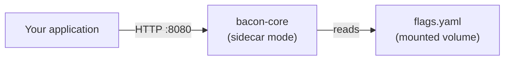

# 01 — Sidecar Quickstart

The simplest possible Feature Bacon deployment: a single container reading flags from a YAML config file. No database, no message broker, no external dependencies.

## What this demonstrates

- **Sidecar deployment mode** — one instance dedicated to your application
- **Config-file persistence** — flags defined as code, mounted read-only
- **Flag types** — boolean toggles, string variants, deterministic and random evaluation
- **Rules engine** — attribute conditions, rollout percentages, operator matching
- **Health and metrics** — `/healthz`, `/readyz`, and `/metrics` endpoints

## Architecture



## Prerequisites

- [Docker](https://docs.docker.com/get-docker/) (with Compose v2)
- [curl](https://curl.se/)
- [jq](https://jqlang.github.io/jq/)

## Quick start

```bash
docker compose up --build
```

Wait for the health check to pass, then in another terminal:

```bash
bash test.sh
```

## Flags in this sample

| Flag | Type | Semantics | Behavior |
|------|------|-----------|----------|
| `maintenance_mode` | boolean | deterministic | Kill switch — disabled by default. Flip `enabled: true` to block traffic. |
| `dark_mode` | boolean | deterministic | Enabled for 50% of production users (hash-based bucketing on `subjectId`). |
| `checkout_redesign` | string | deterministic | Pro/Enterprise users always see `redesign`. Everyone else: 30% get `redesign`, rest get `control`. |
| `new_pricing` | boolean | random | 20% of evaluations return `true`, non-deterministically. |
| `beta_features` | boolean | deterministic | Enabled at 100% for users whose email ends with `@acme.com`. |

## What to expect

**`maintenance_mode`** — always `false` because `enabled: false` on the flag definition. The entire flag is off regardless of rules.

**`dark_mode`** — roughly half the users see `true`. The evaluation hashes `subjectId` to determine the bucket, so the same user always gets the same result.

**`checkout_redesign`** — two rules evaluated in order:
1. If `attributes.plan` is `"pro"` or `"enterprise"` → 100% get variant `redesign`
2. For everyone else → 30% get variant `redesign`, 70% fall through to the default (`control`)

**`new_pricing`** — uses `random` semantics, so each call independently has a 20% chance of returning `true`. Results are **not** consistent across calls for the same user.

**`beta_features`** — the `ends_with` operator checks the email attribute. `dev@acme.com` matches and gets `true`. `customer@gmail.com` does not match and falls through to the default (`false`).

## Modifying flags

Edit `flags.yaml` and restart the container:

```bash
docker compose restart bacon
```

The config file is read at startup. Changes require a restart in sidecar/file mode.

## Limitations of config-file mode

- **Read-only** — the management API (POST/PUT/DELETE on `/api/v1/flags`) returns `409 read-only-mode`
- **No persistent assignments** — flags with `semantics: persistent` are not supported (requires a writable persistence module)
- **No sticky experiments** — A/B experiments that need stored assignments require Postgres, Redis, or MongoDB
- **No multi-tenant** — sidecar mode uses an implicit default tenant

## Next steps

- [02-saas-multi-tenant](../02-saas-multi-tenant/) — full multi-tenant deployment with Postgres, Kafka, auth, and experiments
- [03-redis-sidecar](../03-redis-sidecar/) — sidecar mode with Redis for persistent flag assignments
- [04-config-as-code](../04-config-as-code/) — GitOps-style per-environment flag management
