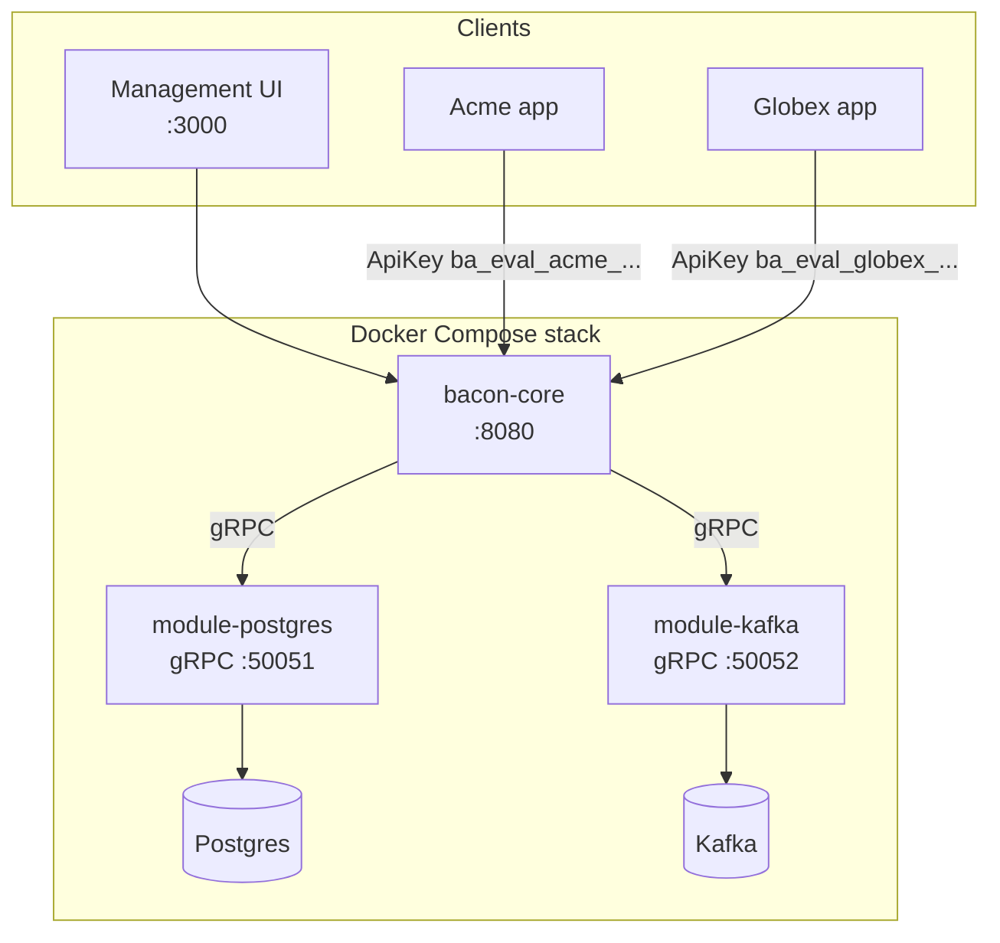
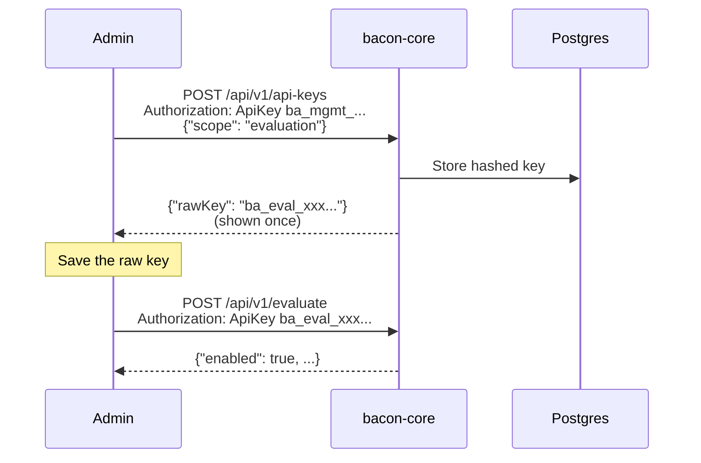
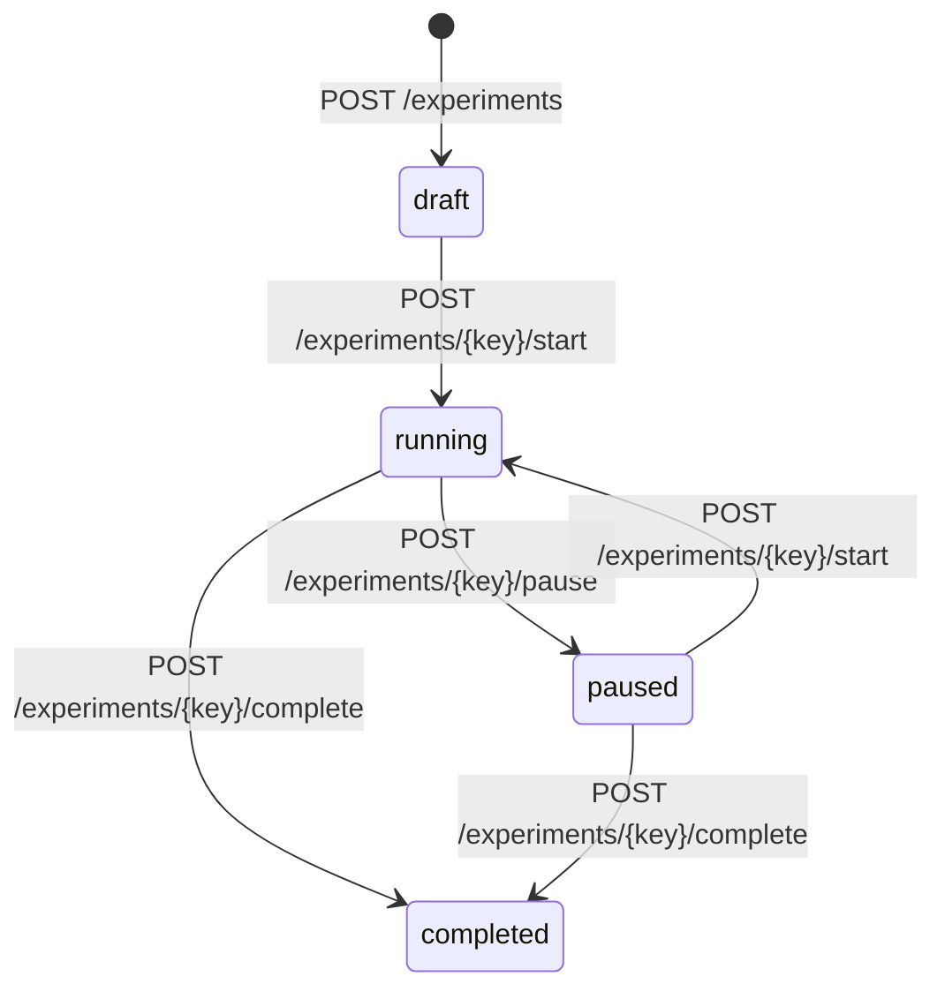

# 02 — SaaS Multi-Tenant

A full-stack Feature Bacon deployment with Postgres persistence, Kafka event streaming, API key authentication, and a management UI. Two tenants (`acme` and `globex`) demonstrate complete tenant isolation.

## What this demonstrates

- **SaaS deployment mode** — one deployment serving multiple tenants
- **Postgres persistence** — writable storage for flags, experiments, assignments, and API keys
- **Kafka event streaming** — flag evaluation and management events published to a topic
- **API key authentication** — management and evaluation scopes with tenant binding
- **Tenant isolation** — each tenant has independent flags, experiments, and keys
- **Experiment lifecycle** — create, start, pause, and complete A/B tests
- **Management UI** — React/Next.js frontend for flag and experiment administration

## Architecture



## Prerequisites

- [Docker](https://docs.docker.com/get-docker/) (with Compose v2)
- [curl](https://curl.se/)
- [jq](https://jqlang.github.io/jq/)

## Quick start

**1. Start the stack**

```bash
docker compose up --build
```

Wait until all services are healthy. Postgres and Kafka need a few seconds to initialize.

**2. Seed tenants, flags, experiments, and API keys**

```bash
bash seed.sh
```

The script outputs evaluation API keys for both tenants. Save them — you'll need them for testing.

**3. Run tests**

```bash
ACME_EVAL_KEY=<key-from-seed> GLOBEX_EVAL_KEY=<key-from-seed> bash test.sh
```

**4. Open the management UI**

Visit [http://localhost:3000](http://localhost:3000) to manage flags and experiments through the web interface.

## Services

| Service | Port | Description |
|---------|------|-------------|
| `bacon-core` | 8080 | HTTP API (evaluation + management) |
| `frontend` | 3000 | Management UI |
| `postgres` | 5432 | Flag and key storage |
| `kafka` | 9092 | Event streaming |
| `module-postgres` | 50051 (internal) | Persistence gRPC module |
| `module-kafka` | 50052 (internal) | Publisher gRPC module |

## API key workflow

Bootstrap management keys are configured via `BACON_API_KEYS` in the compose file. These are used to create additional keys through the API:



| Scope | Can do |
|-------|--------|
| `management` | CRUD flags, experiments, API keys |
| `evaluation` | Evaluate flags and batch evaluate |

## Experiment lifecycle



The seed script creates an `onboarding_flow` experiment for tenant `acme` with three variants (`control`, `streamlined`, `guided_tour`) and starts it immediately.

## Tenant isolation

Both tenants define a `dark_mode` flag but with different rules:

| Tenant | `dark_mode` behavior |
|--------|---------------------|
| acme | 100% for pro/enterprise, 25% for everyone else |
| globex | 100% for all users |

Evaluating `beta_search` with an acme key returns `not_found` — that flag only exists for globex.

## Monitoring

- **Health**: `GET /healthz` — liveness probe (no auth)
- **Readiness**: `GET /readyz` — checks Postgres and Kafka connectivity (no auth)
- **Metrics**: `GET /metrics` — Prometheus-compatible, includes per-tenant evaluation counters

## Cleanup

```bash
docker compose down -v
```

The `-v` flag removes the Postgres volume so you start fresh next time.

## Next steps

- [03-redis-sidecar](../03-redis-sidecar/) — sidecar mode with Redis for persistent sticky assignments
- [04-config-as-code](../04-config-as-code/) — GitOps-style per-environment flag management
