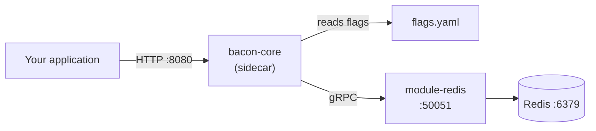
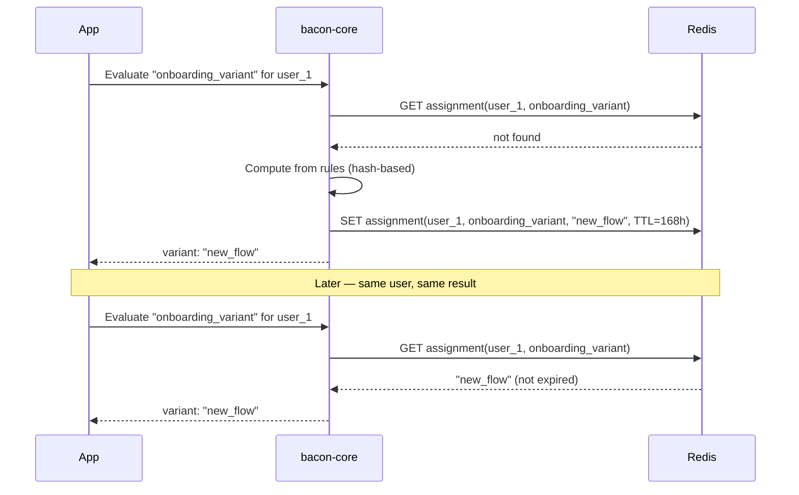

# 03 — Redis Sidecar

Sidecar mode with Redis persistence. This sample demonstrates **sticky flag assignments** — once a user is bucketed into a variant, they see the same result across sessions until the TTL expires.

## What this demonstrates

- **Sidecar mode with writable persistence** — flags defined in config, assignments stored in Redis
- **Persistent semantics** — sticky assignments with configurable TTL
- **Mixed semantics** — persistent and deterministic flags side by side
- **Assignment consistency** — same user always gets the same variant
- **TTL-based expiry** — assignments expire and get re-evaluated

## Architecture



## How persistent flags work



## Prerequisites

- [Docker](https://docs.docker.com/get-docker/) (with Compose v2)
- [curl](https://curl.se/)
- [jq](https://jqlang.github.io/jq/)

## Quick start

```bash
docker compose up --build
```

In another terminal:

```bash
bash test.sh
```

## Flags in this sample

| Flag | Type | Semantics | TTL | Behavior |
|------|------|-----------|-----|----------|
| `onboarding_variant` | string | persistent | 168h (7 days) | 50% get `new_flow`, 50% get `classic`. Sticky per user. |
| `premium_banner` | boolean | persistent | 24h | 30% of free-plan users see the banner. Sticky per user. |
| `search_algorithm` | string | deterministic | — | 33% `vector`, 33% `hybrid`, 34% `keyword`. Hash-based, no storage. |
| `maintenance_mode` | boolean | deterministic | — | Kill switch, disabled by default. |

## What to expect

**Sticky assignments** — run the test script twice. Users assigned to `new_flow` in the first run will still see `new_flow` in the second run, because the assignment is stored in Redis.

**Mixed behavior** — `search_algorithm` is deterministic (computed from hash, no Redis lookup), while `onboarding_variant` is persistent (checked against Redis first).

**TTL expiry** — after the TTL expires, the assignment is re-evaluated. You can test this by setting a short TTL (e.g. `10s`) in `flags.yaml` and restarting.

## Inspecting Redis

You can inspect the stored assignments directly:

```bash
docker compose exec redis redis-cli KEYS '*'
docker compose exec redis redis-cli GET <key>
```

## Cleanup

```bash
docker compose down -v
```

## Next steps

- [01-sidecar-quickstart](../01-sidecar-quickstart/) — simplest setup with no external dependencies
- [02-saas-multi-tenant](../02-saas-multi-tenant/) — full SaaS deployment with Postgres and Kafka
- [04-config-as-code](../04-config-as-code/) — GitOps-style per-environment flag management
