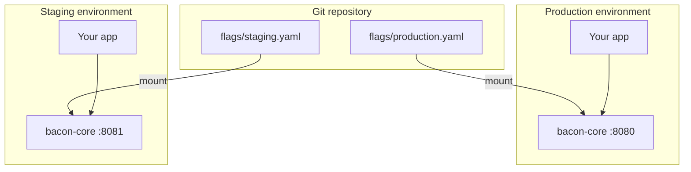
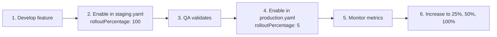

# 04 — Config as Code

GitOps-style flag management using per-environment config files. Two instances of bacon-core run side by side — one for production, one for staging — each reading a different flags file. This is how you manage feature flags as code in a CI/CD pipeline.

## What this demonstrates

- **Flags as code** — flag definitions version-controlled alongside application code
- **Per-environment configs** — different rollout strategies per environment
- **Progressive rollout** — conservative production settings, aggressive staging
- **Environment-only flags** — flags that exist in staging but not production
- **GitOps workflow** — change flags via PR, deploy via CI/CD

## Architecture



## Prerequisites

- [Docker](https://docs.docker.com/get-docker/) (with Compose v2)
- [curl](https://curl.se/)
- [jq](https://jqlang.github.io/jq/)

## Quick start

```bash
docker compose up --build
```

This starts two bacon-core instances:
- **Production** on port `8080` (reads `flags/production.yaml`)
- **Staging** on port `8081` (reads `flags/staging.yaml`)

In another terminal:

```bash
bash test.sh
```

## Flag comparison

| Flag | Production | Staging |
|------|-----------|---------|
| `dark_mode` | 100% for pro/enterprise, **10%** for others | **100%** for everyone |
| `new_search` | **Disabled** (not yet ready) | **Enabled** 100% (QA testing) |
| `checkout_v2` | 100% for beta testers, **5%** for others | **100%** for everyone |
| `maintenance_mode` | Disabled | Disabled |
| `rate_limit_tier` | `unlimited` for enterprise, `high` for pro, `standard` for free | **`high`** for everyone |
| `debug_panel` | **Not defined** (returns `not_found`) | **Enabled** 100% |

## Progressive rollout workflow

A typical workflow for rolling out `new_search` from staging to production:



Each step is a PR that changes the YAML file. Review, merge, deploy.

**Step 1** — currently in the sample: `new_search` is enabled at 100% in staging, disabled in production.

**Step 2** — to begin the production rollout, edit `flags/production.yaml`:

```yaml
  - key: new_search
    type: boolean
    semantics: deterministic
    enabled: true
    description: "New search — 5% canary in production"
    rules:
      - conditions: []
        rolloutPercentage: 5
    defaultResult:
      enabled: false
```

**Step 3** — increase gradually: change `rolloutPercentage` from `5` to `25`, then `50`, then `100`.

## Environment-only flags

The `debug_panel` flag exists only in `staging.yaml`. Evaluating it against the production instance returns `enabled: false` with `reason: not_found`. This pattern is useful for:

- Debug/diagnostic tools that should never appear in production
- Experimental features not yet ready for any production traffic
- Environment-specific behavior (e.g. mock payment providers in staging)

## GitOps integration

In a real CI/CD pipeline, the flags directory would be deployed like any other config:

```yaml
# Example: Kubernetes ConfigMap from flags directory
apiVersion: v1
kind: ConfigMap
metadata:
  name: bacon-flags
data:
  flags.yaml: |
    # contents of flags/production.yaml
```

Or with Docker, mount the appropriate file based on the deployment target:

```bash
docker run -v ./flags/production.yaml:/etc/bacon/flags.yaml:ro bacon-core
```

## Modifying flags

Edit the YAML file and restart the corresponding container:

```bash
# Edit production flags
vim flags/production.yaml

# Restart only the production instance
docker compose restart bacon-production
```

## Limitations

- **Read-only** — the management API returns `409 read-only-mode` for write operations
- **Restart required** — flag changes require a container restart (config is read at startup)
- **No persistent assignments** — `persistent` semantics require a writable persistence module
- **No experiments** — experiment lifecycle (start/pause/complete) requires a writable backend

## Next steps

- [01-sidecar-quickstart](../01-sidecar-quickstart/) — single-environment quickstart
- [02-saas-multi-tenant](../02-saas-multi-tenant/) — full SaaS deployment with dynamic flag management
- [03-redis-sidecar](../03-redis-sidecar/) — config files + Redis for sticky assignments
