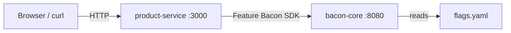

# Go SDK Sample — Product Catalog Service

A realistic HTTP API server that uses the Feature Bacon Go SDK to control product catalog behavior with feature flags.

## What this demonstrates

- Initializing the Go SDK client with `bacon.NewClient`
- **Batch evaluation** — fetching multiple flags in a single request via `EvaluateBatch`
- **Convenience helpers** — `IsEnabled` for boolean checks, `GetVariant` for A/B tests
- **Health checking** — `Healthy` to report upstream flag service status
- Structuring a Go HTTP service around feature flags

## Architecture



The **product-service** is a plain `net/http` server. On every request it calls
Feature Bacon to evaluate the relevant flags, then adjusts the response
accordingly (pricing, checkout variant, enabled features).

## Prerequisites

- Docker & Docker Compose **or** Go 1.21+
- `curl` and `jq` (for the test script)

## Quick start

### With Docker Compose (recommended)

```bash
cd samples/05-sdk-go
docker compose up --build
```

This starts both **bacon-core** (sidecar mode, serving flags from `flags.yaml`)
and the **product-service**.

### Without Docker

Start a Feature Bacon instance separately, then:

```bash
cd samples/05-sdk-go
go run .                            # defaults to BACON_URL=http://localhost:8080
```

Override with environment variables:

```bash
BACON_URL=http://my-bacon:8080 BACON_API_KEY=secret PORT=4000 go run .
```

## Testing

```bash
chmod +x test.sh
./test.sh
```

Or target a custom host:

```bash
BASE_URL=http://localhost:4000 ./test.sh
```

## Endpoints

| Method | Path        | Description                                      |
| ------ | ----------- | ------------------------------------------------ |
| GET    | `/`         | Batch-evaluates all flags for a user             |
| GET    | `/products` | Returns the product catalog with flag-driven pricing and checkout variant |
| GET    | `/health`   | Reports service health including Feature Bacon connectivity |

All endpoints accept an optional `?user=<id>` query parameter. Defaults to `anonymous`.

## How flags affect behavior

| Flag                 | Type    | Effect                                           |
| -------------------- | ------- | ------------------------------------------------ |
| `dark_mode`          | boolean | Returned in the feature map on `/`               |
| `new_pricing`        | boolean | Applies a 10% discount to product prices         |
| `beta_features`      | boolean | Reported in batch evaluation on `/`              |
| `checkout_redesign`  | string  | A/B variant (`control` or `redesign`) shown on `/products` |

## Code walkthrough

### Client initialization

```go
client := bacon.NewClient(baconURL, bacon.WithAPIKey(apiKey))
```

Creates a client pointed at the Feature Bacon instance. The API key is optional
(disabled in this sample via `BACON_AUTH_ENABLED=false`).

### Batch evaluation

```go
results, err := client.EvaluateBatch(r.Context(), []string{
    "dark_mode", "new_pricing", "beta_features", "checkout_redesign",
}, ctx)
```

Evaluates multiple flags in one round-trip. Each result contains `Enabled`,
`Variant`, and `Reason`.

### Convenience methods

```go
showNewPricing := client.IsEnabled(r.Context(), "new_pricing", ctx)
checkoutVariant := client.GetVariant(r.Context(), "checkout_redesign", ctx)
```

`IsEnabled` returns `false` on error. `GetVariant` returns `""` on error.
Both are safe to use without error handling in non-critical paths.

### Health checking

```go
healthy := client.Healthy(r.Context())
```

Calls `GET /healthz` on the Feature Bacon instance. The `/health` endpoint
returns HTTP 503 when the upstream is unhealthy.
