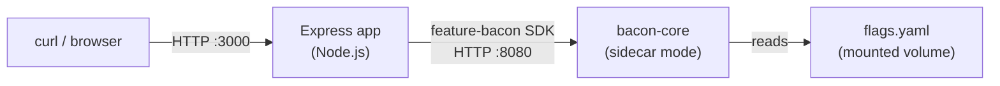

# 06 — JavaScript SDK (Express)

A Node.js Express "e-commerce" API that uses the Feature Bacon JavaScript SDK to drive feature flags. Demonstrates the SDK's `evaluate`, `evaluateBatch`, `isEnabled`, `getVariant`, and `healthy` methods in a realistic server-side context.

## What this demonstrates

- **JavaScript SDK integration** — using the `feature-bacon` package from a Node.js app
- **Batch evaluation** — fetching multiple flags in a single call
- **Convenience helpers** — `isEnabled()` for boolean checks, `getVariant()` for string variants
- **User context from HTTP** — extracting `subjectId`, `plan`, and `country` from query params and headers
- **Flag-driven pricing** — product prices change when the `new_pricing` flag is enabled
- **Health propagation** — app health endpoint includes Feature Bacon connectivity status

## Architecture



## Prerequisites

- [Docker](https://docs.docker.com/get-docker/) (with Compose v2)
- [curl](https://curl.se/)
- [jq](https://jqlang.github.io/jq/)

## Quick start

```bash
docker compose up --build
```

Wait for both services to be ready (the app starts after bacon passes its health check), then in another terminal:

```bash
bash test.sh
```

## API endpoints

| Endpoint | Description |
|----------|-------------|
| `GET /` | Returns all feature flags for the current user |
| `GET /products` | Product listing with flag-driven pricing and checkout variant |
| `GET /health` | Health check including Feature Bacon connectivity |

### User context

Pass user context via query parameters or headers:

| Parameter | Header | Default | Description |
|-----------|--------|---------|-------------|
| `?user=` | `X-User-Id` | `anonymous` | Subject ID for flag evaluation |
| `?plan=` | — | `free` | User plan (`free`, `pro`, `enterprise`) |
| `?country=` | — | `US` | User country code |

### Examples

```bash
# Anonymous user, default context
curl http://localhost:3000/

# Specific user with enterprise plan
curl "http://localhost:3000/?user=user_42&plan=enterprise"

# Products with potential discount
curl "http://localhost:3000/products?user=user_1&plan=pro"

# Health check
curl http://localhost:3000/health

# User context via header
curl -H "X-User-Id: my-user" http://localhost:3000/
```

## Flags in this sample

| Flag | Type | Semantics | Behavior |
|------|------|-----------|----------|
| `maintenance_mode` | boolean | deterministic | Kill switch — disabled by default |
| `dark_mode` | boolean | deterministic | 50% rollout in production (hash-based) |
| `checkout_redesign` | string | deterministic | Pro/Enterprise → `redesign`; everyone else 30% `redesign`, 70% `control` |
| `new_pricing` | boolean | random | 20% chance of new pricing per evaluation |
| `beta_features` | boolean | deterministic | 100% for `@acme.com` emails, off for everyone else |

## SDK usage patterns

### Batch evaluation

Fetch all flags in one round-trip:

```javascript
const results = await client.evaluateBatch(
  ['dark_mode', 'new_pricing', 'beta_features'],
  { subjectId: 'user_42', environment: 'production' }
);
```

### Boolean check

Simple on/off check:

```javascript
const enabled = await client.isEnabled('new_pricing', ctx);
```

### Variant check

Get the string variant for A/B tests:

```javascript
const variant = await client.getVariant('checkout_redesign', ctx);
```

### Health check

Verify connectivity to Feature Bacon:

```javascript
const healthy = await client.healthy();
```

## Running without Docker

If you want to run the app directly (assuming bacon-core is already running on port 8080):

```bash
npm install
BACON_URL=http://localhost:8080 npm start
```

## Project structure

```
samples/06-sdk-javascript/
├── package.json          # Dependencies (express + feature-bacon SDK)
├── app.js                # Express application
├── docker-compose.yaml   # Bacon sidecar + app service
├── Dockerfile            # Multi-step build: SDK → app
├── flags.yaml            # Flag definitions (copied from sample 01)
├── test.sh               # Test script hitting all endpoints
└── README.md             # This file
```
