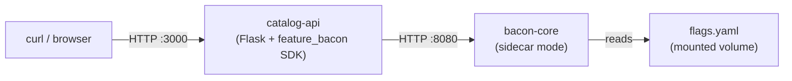

# 07 — Python SDK

A Flask web API that uses the Feature Bacon Python SDK (`feature_bacon`) for feature flag evaluation. The app exposes a product catalog whose pricing, checkout flow, and available features change dynamically based on flag state.

## What this demonstrates

- **Python SDK integration** — `BaconClient`, `EvaluationContext`, single and batch evaluation
- **Feature-flagged business logic** — pricing discounts, A/B checkout variants, beta gating
- **Sidecar deployment** — Flask app talks to a local `bacon-core` instance over HTTP
- **Zero SDK dependencies** — the `feature_bacon` package uses only the Python standard library

## Architecture



## Prerequisites

- [Docker](https://docs.docker.com/get-docker/) (with Compose v2)
- [curl](https://curl.se/)
- [jq](https://jqlang.github.io/jq/)

## Quick start

```bash
docker compose up --build
```

Wait for both services to become healthy, then in another terminal:

```bash
bash test.sh
```

## Endpoints

| Endpoint | Description |
|----------|-------------|
| `GET /` | Batch-evaluates all flags for the current user. Returns a feature map. |
| `GET /products` | Returns a product catalog. Pricing and checkout variant are controlled by flags. |
| `GET /health` | Checks whether the bacon sidecar is reachable. |

All endpoints accept `?user=<id>` and `?plan=<plan>` query parameters to set the evaluation context.

## SDK usage

### Creating a client

```python
from feature_bacon import BaconClient

client = BaconClient("http://localhost:8080", api_key="optional-key")
```

### Building an evaluation context

```python
from feature_bacon import EvaluationContext

ctx = EvaluationContext(
    subject_id="user_42",
    environment="production",
    attributes={"plan": "pro", "source": "web"},
)
```

### Evaluating flags

```python
# Full evaluation result (enabled, variant, reason)
result = client.evaluate("dark_mode", ctx)

# Convenience: just the boolean
enabled = client.is_enabled("new_pricing", ctx)

# Convenience: just the variant string
variant = client.get_variant("checkout_redesign", ctx)

# Batch evaluation — single HTTP round-trip
results = client.evaluate_batch(["flag_a", "flag_b"], ctx)
```

### Health check

```python
healthy = client.healthy()  # True / False
```

## Flags in this sample

| Flag | Type | Semantics | Behavior |
|------|------|-----------|----------|
| `maintenance_mode` | boolean | deterministic | Kill switch — disabled by default. |
| `dark_mode` | boolean | deterministic | 50% rollout in production (hash-based bucketing). |
| `checkout_redesign` | string | deterministic | Pro/Enterprise → `redesign`. Others: 30% `redesign`, 70% `control`. |
| `new_pricing` | boolean | random | 20% of evaluations return `true`, non-deterministically. |
| `beta_features` | boolean | deterministic | 100% for `@acme.com` emails, disabled otherwise. |

## How it works

The Flask app creates a `BaconClient` at startup pointing at the sidecar. Each request builds an `EvaluationContext` from query parameters and evaluates the relevant flags. The SDK makes HTTP calls to bacon-core's `/api/v1/evaluate` and `/api/v1/evaluate/batch` endpoints under the hood.

The `new_pricing` flag uses `random` semantics, so the same user may see different pricing on each request. The `checkout_redesign` flag is deterministic — a given user always lands in the same variant.

## Running without Docker

If you have Python 3.12+ and a local bacon-core running on port 8080:

```bash
pip install flask
pip install ../../sdks/python/
python app.py
```

## Next steps

- [01-sidecar-quickstart](../01-sidecar-quickstart/) — bare sidecar with no SDK, using the HTTP API directly
- [05-sdk-go](../05-sdk-go/) — the same pattern using the Go SDK
