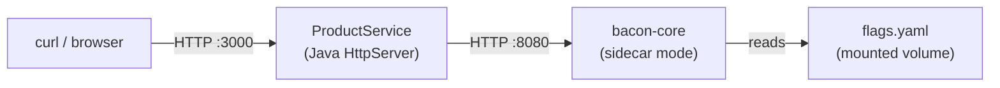

# 08 — Java SDK

A Java HTTP server that uses the Feature Bacon Java SDK (`io.github.orlandoburli:feature-bacon-sdk`) to evaluate feature flags at runtime. No Spring — just `com.sun.net.httpserver.HttpServer` and the SDK.

## What this demonstrates

- **Java SDK integration** — `BaconClient`, `EvaluationContext`, single and batch evaluation
- **Sidecar pattern** — the app talks to a local bacon-core instance over HTTP
- **Feature-gated product catalog** — pricing and checkout variants driven by flags
- **Health checks** — propagating bacon health status through the app

## Architecture



## Prerequisites

- [Docker](https://docs.docker.com/get-docker/) (with Compose v2)
- [curl](https://curl.se/)
- [jq](https://jqlang.github.io/jq/)

## Quick start

```bash
docker compose up --build
```

Wait for both services to start (the product service waits for bacon's health check), then in another terminal:

```bash
bash test.sh
```

## Endpoints

| Endpoint | Description |
|----------|-------------|
| `GET /` | Batch-evaluates all flags for the user and returns a feature map |
| `GET /products` | Returns a product catalog with flag-driven pricing and checkout variant |
| `GET /health` | Health check — reports bacon connectivity status |

All endpoints accept `?user=<id>&plan=<plan>` query parameters to set the evaluation context.

## SDK usage

### Creating a client

```java
BaconClient client = BaconClient.builder("http://localhost:8080")
    .apiKey("my-key")
    .build();
```

### Building evaluation context

```java
EvaluationContext ctx = EvaluationContext.builder("user_123")
    .environment("production")
    .attribute("plan", "pro")
    .build();
```

### Evaluating flags

```java
// Full result with metadata
EvaluationResult result = client.evaluate("dark_mode", ctx);
result.isEnabled();   // boolean
result.getVariant();  // String
result.getReason();   // String

// Convenience methods
boolean enabled = client.isEnabled("new_pricing", ctx);
String variant = client.getVariant("checkout_redesign", ctx);

// Batch evaluation
List<EvaluationResult> results = client.evaluateBatch(
    List.of("dark_mode", "new_pricing", "beta_features"),
    ctx
);
```

## Flags in this sample

| Flag | Type | Semantics | Behavior |
|------|------|-----------|----------|
| `dark_mode` | boolean | deterministic | 50% rollout in production (hash-based bucketing) |
| `new_pricing` | boolean | random | 20% of evaluations return `true` |
| `checkout_redesign` | string | deterministic | Pro/Enterprise get `redesign`; others: 30% `redesign`, 70% `control` |
| `beta_features` | boolean | deterministic | 100% for `@acme.com` emails |
| `maintenance_mode` | boolean | deterministic | Kill switch — disabled by default |

## How the app uses flags

**Home page (`/`)** — calls `evaluateBatch` to fetch all four flags at once and returns a JSON feature map. This is efficient for pages that need multiple flags.

**Products (`/products`)** — uses `isEnabled("new_pricing")` to apply a 10% discount and `getVariant("checkout_redesign")` to select the checkout experience. Shows how individual flag checks drive business logic.

**Health (`/health`)** — calls `client.healthy()` and returns 503 if bacon is unreachable, so load balancers can route traffic away from degraded instances.

## Build details

The Dockerfile uses a two-stage build:

1. **Builder stage** — installs the Java SDK from `sdks/java/` into the local Maven repository, then builds the app with `maven-shade-plugin` to produce a fat JAR
2. **Runtime stage** — runs the fat JAR on `eclipse-temurin:21-jre-alpine`

The build context is `../../` (repo root) so both the SDK source and sample source are available.

## Next steps

- [01-sidecar-quickstart](../01-sidecar-quickstart/) — raw bacon-core API without an SDK
- [05-sdk-go](../05-sdk-go/) — same pattern in Go
