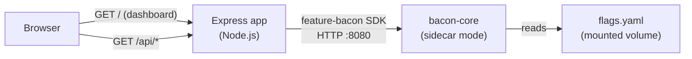

# 10 — Backend Feature Flags

An Express.js dashboard that demonstrates how feature flags control backend behavior in real-time. Switch between user plans and watch pricing algorithms, search engines, rate limits, caching strategies, and API access change instantly.

## What this demonstrates

- **Flag-driven pricing** — three pricing algorithms (standard, dynamic, volume discount) selected per-user
- **Search algorithm switching** — exact vs. fuzzy search controlled by a rollout flag
- **Tiered rate limiting** — premium users get relaxed limits, others get strict defaults
- **Cache strategy rollout** — gradually rolling out aggressive caching to 40% of users
- **Feature gating** — premium API endpoints locked behind a boolean flag
- **Visual dashboard** — server-rendered HTML showing all flag states and live API responses

## Architecture



## Prerequisites

- [Docker](https://docs.docker.com/get-docker/) (with Compose v2)
- [curl](https://curl.se/)
- [jq](https://jqlang.github.io/jq/)

## Quick start

```bash
docker compose up --build
```

Wait for both services to be ready, then open http://localhost:3000 in a browser or run:

```bash
bash test.sh
```

## Switching users

Use the dashboard buttons or pass query parameters:

| User | URL |
|------|-----|
| Free | `/?user=free_user&plan=free` |
| Premium | `/?user=premium_user&plan=premium` |
| Enterprise | `/?user=enterprise_user&plan=enterprise` |

## API endpoints

| Endpoint | Description |
|----------|-------------|
| `GET /` | Visual dashboard showing all flag states |
| `GET /api/products` | Products with flag-driven pricing |
| `GET /api/search?q=term` | Search using flag-selected algorithm |
| `GET /api/premium/analytics` | Analytics (requires premium_api flag) |
| `GET /health` | Health check with Feature Bacon status |

### User context

| Parameter | Header | Default | Description |
|-----------|--------|---------|-------------|
| `?user=` | `X-User-Id` | `anonymous` | Subject ID for flag evaluation |
| `?plan=` | — | `free` | User plan (`free`, `premium`, `enterprise`) |

### Examples

```bash
# Standard pricing for free user
curl "http://localhost:3000/api/products?user=alice&plan=free"

# Volume discount for enterprise
curl "http://localhost:3000/api/products?user=bob&plan=enterprise"

# Fuzzy search (if rolled out to user)
curl "http://localhost:3000/api/search?q=wid&user=alice"

# Premium analytics (will 403 for free users)
curl "http://localhost:3000/api/premium/analytics?user=alice&plan=free"

# Premium analytics (200 for enterprise)
curl "http://localhost:3000/api/premium/analytics?user=bob&plan=enterprise"
```

## Flags reference

| Flag | Type | Behavior |
|------|------|----------|
| `pricing_algorithm` | string | Enterprise → `volume_discount`; 30% rollout → `dynamic`; default `standard` |
| `search_version` | string | 50% rollout → `v2_fuzzy`; default `v1_exact` |
| `rate_limit` | string | Premium → `relaxed`; default `strict` |
| `cache_strategy` | string | 40% rollout → `aggressive`; default `conservative` |
| `premium_api` | boolean | Premium/Enterprise → enabled; default disabled |

## Modifying flags

Edit `flags.yaml` and restart the bacon sidecar:

```bash
docker compose restart bacon
```

## Running without Docker

With bacon-core already running on port 8080:

```bash
npm install
BACON_URL=http://localhost:8080 npm start
```

## Project structure

```
samples/10-backend-feature-flags/
├── package.json          # Dependencies
├── app.js                # Express server + dashboard
├── app.test.js           # Jest + supertest tests
├── flags.yaml            # Flag definitions
├── docker-compose.yaml   # Bacon sidecar + app
├── Dockerfile            # Multi-step build
├── test.sh               # Integration test script
└── README.md             # This file
```
